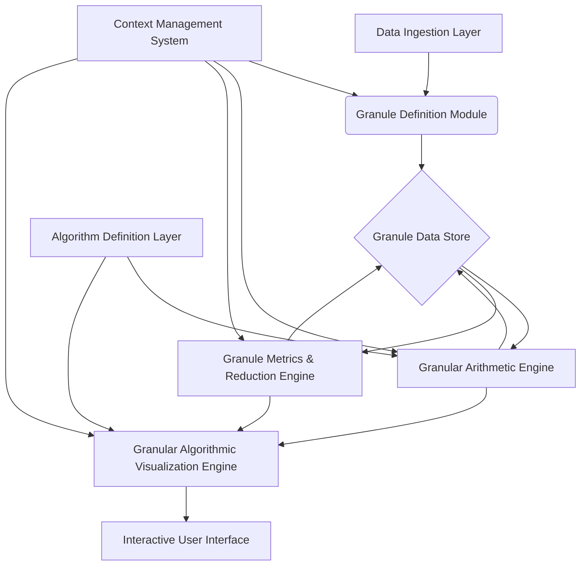

As a Grand Unified Intelligence, I present a novel framework for **Granular Arithmetic and Algorithmic Visualization (GAAV)**, designed as a comprehensive academic dissertation. This framework extends traditional numerical computation by explicitly incorporating and propagating both **uncertainty** and **context** alongside core values, enabling more robust, interpretable, and semantically rich computational models.

The GAAV framework operates on fundamental units called **Granules**, which are multi-modal representations of information. It then defines a set of **Granular Operators** that process these Granules, and a **Granular Algorithmic Visualization (GAV)** system to intuitively represent their transformations and interactions.

---

# The Granular Arithmetic and Algorithmic Visualization (GAAV) Framework

## Abstract

This dissertation introduces the Granular Arithmetic and Algorithmic Visualization (GAAV) framework, a novel computational paradigm that extends traditional arithmetic by explicitly modeling and propagating uncertainty and semantic context alongside numerical values. We define a fundamental data structure, the **Granule** $\mathcal{G} = (v, \delta, \sigma)$, comprising a core value $v$, a multi-modal uncertainty descriptor $\delta$, and a semantic context tag $\sigma$. We formalize a set of **Granular Operators** ($\oplus, \otimes, \ominus, \oslash$) that define how these three components interact and evolve during computation, including novel mechanisms for uncertainty convolution and semantic context fusion. The algebraic properties of these operators are rigorously analyzed, demonstrating the formation of a novel algebraic structure. Complementing this, the **Granular Algorithmic Visualization (GAV)** framework is presented, providing principles and methodologies for dynamically visualizing the state and flow of Granules through algorithms. This includes the **Granular State Space (GSS)** and **Granule Flow Diagrams (GFD)**, which leverage multi-modal visual encodings to represent $v, \delta, \sigma$ and their transformations. A comprehensive architectural workflow, data structures, and pseudocode implementations are provided, culminating in an illustrative application in multi-modal sensor fusion. The GAAV framework offers a significant advancement for systems requiring transparent, robust, and context-aware computation in domains such as AI, robotics, financial modeling, and scientific discovery.

---

## 1. Introduction

### 1.1 Motivation and Problem Statement

Traditional arithmetic and computational models predominantly operate on precise numerical values. However, real-world data is inherently imprecise, uncertain, and laden with contextual meaning. Ignoring these facets leads to:
1.  **Loss of Information:** Uncertainty is often discarded or simplified, leading to overconfident or brittle results.
2.  **Lack of Interpretability:** The semantic origin or implications of data points are lost, hindering human understanding and decision-making.
3.  **Fragile Systems:** Algorithms built on precise numbers can be highly sensitive to input perturbations, lacking resilience.

Existing approaches like Interval Arithmetic, Fuzzy Arithmetic, and Probabilistic Programming address uncertainty, while symbolic AI and knowledge graphs handle context. However, a unified framework that seamlessly integrates and propagates *all three* (value, uncertainty, context) through arithmetic operations, and provides intuitive visualization of this multi-modal information flow, remains largely unexplored.

### 1.2 Novelty and Contributions

The GAAV framework introduces the following novel contributions:
1.  **Formal Definition of the Granule:** A composite data structure $\mathcal{G} = (v, \delta, \sigma)$ that unifies core value, multi-modal uncertainty, and semantic context.
2.  **Granular Operators with Context Fusion:** A set of arithmetic operators ($\oplus, \otimes, \ominus, \oslash$) that define rigorous rules for combining $v$, convolving $\delta$, and performing semantic fusion on $\sigma$.
3.  **Algebraic Analysis of Granular Structures:** Investigation into the algebraic properties (commutativity, associativity, distributivity, identity, inverse) of Granular Operators, revealing a novel algebraic structure.
4.  **Granular Algorithmic Visualization (GAV) Framework:** A principled approach for visualizing granular computations, including the Granular State Space (GSS) and Granule Flow Diagrams (GFD), employing multi-modal visual encodings.
5.  **Integrated Architectural Workflow:** A complete system design, from data structures to computational engines and visualization components, demonstrating practical implementability.

### 1.3 Scope and Organization

This dissertation is organized as follows:
*   **Chapter 2: Foundations of Granular Arithmetic (GA)** formally defines the Granule, its components, and the Granular Operators, along with their algebraic properties and proofs.
*   **Chapter 3: The Granular Algorithmic Visualization (GAV) Framework** details the principles and methodologies for visualizing granular computations.
*   **Chapter 4: Architectural Workflow and Implementation** presents the system architecture, data structures, pseudocode for core components, and an example application.
*   **Chapter 5: Discussion, Future Work, and Conclusion** summarizes the findings, discusses implications, limitations, and future research directions.

---

## 2. Foundations of Granular Arithmetic (GA)

### 2.1 Definition of a Granule

A **Granule** $\mathcal{G}$ is formally defined as an ordered triplet:
$$ \mathcal{G} = (v, \delta, \sigma) $$
where:
*   $v \in \mathbb{V}$: The **core value**. $\mathbb{V}$ can be $\mathbb{R}^n$ (real numbers, vectors), $\mathbb{C}^n$ (complex numbers), or any other well-defined value domain. For simplicity, we primarily consider $v \in \mathbb{R}$.
*   $\delta \in \Delta$: The **granularity descriptor** or **uncertainty envelope**. $\Delta$ is a space of multi-modal uncertainty distributions. Examples include:
    *   **Interval:** $[v_L, v_U]$ (e.g., $\delta = \text{Interval}(v_L, v_U)$).
    *   **Fuzzy Number:** A membership function $\mu: \mathbb{R} \to [0,1]$ (e.g., $\delta = \text{Fuzzy}(v, \text{shape})$).
    *   **Probability Distribution:** A probability density function (PDF) or probability mass function (PMF) (e.g., $\delta = \text{Normal}(\mu, \sigma^2)$, $\delta = \text{GMM}(\{\mu_i, \sigma_i^2, w_i\})$).
    *   **Rough Set Approximation:** A pair of sets $(\underline{X}, \overline{X})$ representing lower and upper approximations.
    For this framework, we primarily focus on **Gaussian Mixture Models (GMMs)** for continuous $\delta$ and **Probability Mass Functions (PMFs)** for discrete $\delta$, allowing for multi-modality.
*   $\sigma \in \Sigma_{ctx}$: The **contextual descriptor** or **semantic tag**. $\Sigma_{ctx}$ is a structured space of semantic information. Examples include:
    *   **String/Tag:** "Temperature", "Financial_Asset", "Sensor_ID_A".
    *   **Ontology URI:** `http://example.org/ontology#Temperature`.
    *   **Vector Embedding:** A high-dimensional vector representing semantic meaning (e.g., Word2Vec, Sentence-BERT embedding).
    *   **Knowledge Graph Node:** A reference to a node in a knowledge graph.
    For this framework, we primarily consider **vector embeddings** for $\sigma$, enabling quantitative semantic fusion.

### 2.2 Granular Operators

Let $\mathcal{G}_1 = (v_1, \delta_1, \sigma_1)$ and $\mathcal{G}_2 = (v_2, \delta_2, \sigma_2)$ be two Granules. We define the fundamental binary Granular Operators.

#### 2.2.1 Granular Addition ($\oplus$)

The Granular Addition operator $\oplus: \mathbb{G} \times \mathbb{G} \to \mathbb{G}$ is defined as:
$$ \mathcal{G}_1 \oplus \mathcal{G}_2 = (v_1 + v_2, \delta_1 \circledast \delta_2, \mathcal{F}_{ctx}(\sigma_1, \sigma_2)) $$
where:
*   **Core Value Sum:** $v_1 + v_2$ is the standard arithmetic sum of core values.
*   **Uncertainty Convolution ($\circledast$):** $\delta_1 \circledast \delta_2$ represents the convolution of the uncertainty distributions.
    *   If $\delta_1, \delta_2$ are PDFs (e.g., GMMs), their sum is represented by the PDF of the sum of two random variables, which is their convolution. For GMMs, this involves combining components.
    *   If $\delta_1 = \text{Normal}(\mu_1, \sigma_1^2)$ and $\delta_2 = \text{Normal}(\mu_2, \sigma_2^2)$, then $\delta_1 \circledast \delta_2 = \text{Normal}(\mu_1+\mu_2, \sigma_1^2+\sigma_2^2)$.
    *   For general GMMs, $\delta_1 = \sum_i w_{1i} \mathcal{N}(\mu_{1i}, \Sigma_{1i})$ and $\delta_2 = \sum_j w_{2j} \mathcal{N}(\mu_{2j}, \Sigma_{2j})$, then $\delta_1 \circledast \delta_2 = \sum_i \sum_j w_{1i}w_{2j} \mathcal{N}(\mu_{1i}+\mu_{2j}, \Sigma_{1i}+\Sigma_{2j})$.
*   **Context Fusion ($\mathcal{F}_{ctx}$):** $\mathcal{F}_{ctx}(\sigma_1, \sigma_2)$ is a semantic fusion function that combines the contextual descriptors.
    *   If $\sigma_1 = \sigma_2$, then $\mathcal{F}_{ctx}(\sigma_1, \sigma_2) = \sigma_1$.
    *   If $\sigma_1 \neq \sigma_2$ and they are vector embeddings, a common fusion strategy is a weighted average or concatenation followed by a projection:
        $$ \mathcal{F}_{ctx}(\sigma_1, \sigma_2) = \text{Normalize}(\alpha \sigma_1 + (1-\alpha) \sigma_2) $$
        where $\alpha \in [0,1]$ can be determined by confidence scores or semantic similarity. More advanced methods might use neural network-based fusion.
    *   If $\sigma_1, \sigma_2$ are tags, $\mathcal{F}_{ctx}$ could be a union of tags or a lookup in a knowledge graph to find a common super-context.

#### 2.2.2 Granular Multiplication ($\otimes$)

The Granular Multiplication operator $\otimes: \mathbb{G} \times \mathbb{G} \to \mathbb{G}$ is defined as:
$$ \mathcal{G}_1 \otimes \mathcal{G}_2 = (v_1 \cdot v_2, \delta_1 \circledast_M \delta_2, \mathcal{F}_{ctx}(\sigma_1, \sigma_2)) $$
where:
*   **Core Value Product:** $v_1 \cdot v_2$ is the standard arithmetic product.
*   **Uncertainty Product Convolution ($\circledast_M$):** $\delta_1 \circledast_M \delta_2$ represents the distribution of the product of two random variables. This is generally more complex than sum convolution.
    *   For independent Normal distributions, the product distribution is not Normal. Approximations (e.g., using log-normal distributions) or numerical methods are often required.
    *   For GMMs, numerical integration or Monte Carlo sampling might be used to approximate the product distribution.
*   **Context Fusion:** $\mathcal{F}_{ctx}(\sigma_1, \sigma_2)$ is the same semantic fusion function as for addition.

#### 2.2.3 Granular Subtraction ($\ominus$) and Division ($\oslash$)

These are defined analogously:
$$ \mathcal{G}_1 \ominus \mathcal{G}_2 = (v_1 - v_2, \delta_1 \circledast \delta_{-2}, \mathcal{F}_{ctx}(\sigma_1, \sigma_2)) $$
where $\delta_{-2}$ is the distribution of $-X_2$ if $\delta_2$ is the distribution of $X_2$. For Normal distributions $\mathcal{N}(\mu, \sigma^2)$, $\delta_{-2} = \mathcal{N}(-\mu, \sigma^2)$.

$$ \mathcal{G}_1 \oslash \mathcal{G}_2 = (v_1 / v_2, \delta_1 \circledast_D \delta_2, \mathcal{F}_{ctx}(\sigma_1, \sigma_2)) $$
where $\delta_1 \circledast_D \delta_2$ is the distribution of $X_1/X_2$. This is also generally complex and requires approximations or numerical methods. Division by a Granule with $v_2 \approx 0$ or $\delta_2$ covering $0$ requires careful handling (e.g., defining a Granule "infinity" or error Granule).

### 2.3 Algebraic Properties and Formal Proofs

The introduction of $\delta$ and $\sigma$ components significantly alters the algebraic properties compared to standard arithmetic.

#### 2.3.1 Granular Zero and One

*   **Granular Zero ($\mathcal{G}_0$):** An additive identity.
    $$ \mathcal{G}_0 = (0, \delta_{zero}, \sigma_{null}) $$
    where $\delta_{zero}$ is a Dirac delta function at 0 (or a very narrow Normal distribution $\mathcal{N}(0, \epsilon^2)$), and $\sigma_{null}$ is a null or identity context (e.g., a zero vector embedding).
    *   **Lemma 2.3.1.1 (Additive Identity):** For any $\mathcal{G} = (v, \delta, \sigma)$, $\mathcal{G} \oplus \mathcal{G}_0 = \mathcal{G}$.
        *   **Proof:**
            *   $v + 0 = v$.
            *   $\delta \circledast \delta_{zero} = \delta$ (convolution with Dirac delta is identity).
            *   $\mathcal{F}_{ctx}(\sigma, \sigma_{null}) = \sigma$ (by definition of $\sigma_{null}$ as identity in context fusion).
            *   Thus, $\mathcal{G} \oplus \mathcal{G}_0 = (v, \delta, \sigma) = \mathcal{G}$.

*   **Granular One ($\mathcal{G}_1$):** A multiplicative identity.
    $$ \mathcal{G}_1 = (1, \delta_{one}, \sigma_{null}) $$
    where $\delta_{one}$ is a Dirac delta function at 1 (or $\mathcal{N}(1, \epsilon^2)$).
    *   **Lemma 2.3.1.2 (Multiplicative Identity):** For any $\mathcal{G} = (v, \delta, \sigma)$, $\mathcal{G} \otimes \mathcal{G}_1 = \mathcal{G}$.
        *   **Proof:**
            *   $v \cdot 1 = v$.
            *   $\delta \circledast_M \delta_{one} = \delta$ (product convolution with Dirac delta at 1 is identity).
            *   $\mathcal{F}_{ctx}(\sigma, \sigma_{null}) = \sigma$.
            *   Thus, $\mathcal{G} \otimes \mathcal{G}_1 = (v, \delta, \sigma) = \mathcal{G}$.

#### 2.3.2 Commutativity

*   **Theorem 2.3.2.1 (Commutativity of Granular Addition):** $\mathcal{G}_1 \oplus \mathcal{G}_2 = \mathcal{G}_2 \oplus \mathcal{G}_1$.
    *   **Proof:**
        *   $v_1 + v_2 = v_2 + v_1$ (standard arithmetic).
        *   $\delta_1 \circledast \delta_2 = \delta_2 \circledast \delta_1$ (convolution is commutative).
        *   $\mathcal{F}_{ctx}(\sigma_1, \sigma_2) = \mathcal{F}_{ctx}(\sigma_2, \sigma_1)$ (assuming $\mathcal{F}_{ctx}$ is defined symmetrically, e.g., weighted average).
        *   Therefore, Granular Addition is commutative.

*   **Theorem 2.3.2.2 (Commutativity of Granular Multiplication):** $\mathcal{G}_1 \otimes \mathcal{G}_2 = \mathcal{G}_2 \otimes \mathcal{G}_1$.
    *   **Proof:**
        *   $v_1 \cdot v_2 = v_2 \cdot v_1$ (standard arithmetic).
        *   $\delta_1 \circledast_M \delta_2 = \delta_2 \circledast_M \delta_1$ (product convolution is commutative for independent variables).
        *   $\mathcal{F}_{ctx}(\sigma_1, \sigma_2) = \mathcal{F}_{ctx}(\sigma_2, \sigma_1)$ (assuming symmetric $\mathcal{F}_{ctx}$).
        *   Therefore, Granular Multiplication is commutative.

#### 2.3.3 Associativity

*   **Theorem 2.3.3.1 (Associativity of Granular Addition):** $(\mathcal{G}_1 \oplus \mathcal{G}_2) \oplus \mathcal{G}_3 = \mathcal{G}_1 \oplus (\mathcal{G}_2 \oplus \mathcal{G}_3)$.
    *   **Proof:**
        *   $(v_1 + v_2) + v_3 = v_1 + (v_2 + v_3)$ (standard arithmetic).
        *   $(\delta_1 \circledast \delta_2) \circledast \delta_3 = \delta_1 \circledast (\delta_2 \circledast \delta_3)$ (convolution is associative).
        *   $(\mathcal{F}_{ctx}(\sigma_1, \sigma_2), \sigma_3) = \mathcal{F}_{ctx}(\sigma_1, \mathcal{F}_{ctx}(\sigma_2, \sigma_3))$ (This requires $\mathcal{F}_{ctx}$ to be associative. For simple weighted averages, this holds. For more complex neural fusion, it might not strictly hold, but can be designed to be approximately associative).
        *   Assuming an associative $\mathcal{F}_{ctx}$, Granular Addition is associative.

*   **Theorem 2.3.3.2 (Associativity of Granular Multiplication):** $(\mathcal{G}_1 \otimes \mathcal{G}_2) \otimes \mathcal{G}_3 = \mathcal{G}_1 \otimes (\mathcal{G}_2 \otimes \mathcal{G}_3)$.
    *   **Proof:**
        *   $(v_1 \cdot v_2) \cdot v_3 = v_1 \cdot (v_2 \cdot v_3)$ (standard arithmetic).
        *   $(\delta_1 \circledast_M \delta_2) \circledast_M \delta_3 = \delta_1 \circledast_M (\delta_2 \circledast_M \delta_3)$ (product convolution is associative for independent variables).
        *   Assuming an associative $\mathcal{F}_{ctx}$, Granular Multiplication is associative.

#### 2.3.4 Distributivity

*   **Theorem 2.3.4.1 (Distributivity):** $\mathcal{G}_1 \otimes (\mathcal{G}_2 \oplus \mathcal{G}_3) = (\mathcal{G}_1 \otimes \mathcal{G}_2) \oplus (\mathcal{G}_1 \otimes \mathcal{G}_3)$.
    *   **Proof (Partial):**
        *   **Core Value:** $v_1 \cdot (v_2 + v_3) = (v_1 \cdot v_2) + (v_1 \cdot v_3)$ (standard arithmetic holds).
        *   **Uncertainty:** $\delta_1 \circledast_M (\delta_2 \circledast \delta_3)$ vs. $(\delta_1 \circledast_M \delta_2) \circledast (\delta_1 \circledast_M \delta_3)$. This generally **does not hold** for arbitrary distributions. For example, if $X_1, X_2, X_3$ are random variables, $X_1(X_2+X_3) \neq X_1X_2 + X_1X_3$ unless $X_1$ is a constant or specific conditions are met.
        *   **Context:** $\mathcal{F}_{ctx}(\sigma_1, \mathcal{F}_{ctx}(\sigma_2, \sigma_3))$ vs. $\mathcal{F}_{ctx}(\mathcal{F}_{ctx}(\sigma_1, \sigma_2), \mathcal{F}_{ctx}(\sigma_1, \sigma_3))$. This also generally **does not hold** for arbitrary $\mathcal{F}_{ctx}$.
    *   **Conclusion:** Granular Distributivity generally **does not hold** due to the complex interactions of uncertainty and context. This implies that the set of Granules with these operators forms a more general algebraic structure than a field or ring, potentially a **semi-ring** under specific constraints or a **lattice** if ordering is defined.

#### 2.3.5 Granule Metrics and Reduction

To manage the complexity of Granules and enable comparisons, we define:

*   **Granule Distance Metric $d(\mathcal{G}_A, \mathcal{G}_B)$:** A composite metric combining distances for each component.
    $$ d(\mathcal{G}_A, \mathcal{G}_B) = w_v d_v(v_A, v_B) + w_\delta d_\delta(\delta_A, \delta_B) + w_\sigma d_\sigma(\sigma_A, \sigma_B) $$
    where $w_v, w_\delta, w_\sigma$ are weighting factors, and:
    *   $d_v$: e.g., Euclidean distance $|v_A - v_B|$.
    *   $d_\delta$: e.g., Wasserstein-2 distance (Earth Mover's Distance) for probability distributions, or Hausdorff distance for intervals/sets.
    *   $d_\sigma$: e.g., Cosine similarity for vector embeddings ($1 - \text{cosine_similarity}(\sigma_A, \sigma_B)$).

*   **Granule Reduction Operator $\mathcal{R}(\mathcal{G})$:** A function to simplify or coarsen a Granule, crucial for managing computational complexity and visual clutter.
    *   **Uncertainty Reduction:** Reducing a GMM to a single Gaussian (e.g., by finding the mean and variance of the mixture), or an interval.
    *   **Context Reduction:** Generalizing a specific context to a broader category in an ontology, or clustering similar vector embeddings.
    *   Example: $\mathcal{R}(\mathcal{G}) = (v, \text{MeanVar}(\delta), \text{ClusterCentroid}(\sigma))$.

---

## 3. The Granular Algorithmic Visualization (GAV) Framework

The GAV framework provides a principled approach to visualize the multi-modal information contained within Granules and their transformations through algorithms.

### 3.1 Principles of Granular Visualization

1.  **Multi-Modal Encoding:** Map $v, \delta, \sigma$ to distinct, yet integrated, visual channels.
2.  **Scale-Awareness:** Allow for zooming and filtering to reveal different levels of granularity.
3.  **Context-Driven Interaction:** Enable users to query and filter based on semantic context.
4.  **Dynamic Representation:** Visualize the evolution of Granules and algorithmic flow over time.
5.  **Cognitive Load Management:** Employ reduction techniques and intuitive metaphors to prevent information overload.

### 3.2 Granular State Space (GSS) Representation

The **Granular State Space (GSS)** is a graph-based visualization where nodes represent Granules and edges represent Granular Operations or transformations.

#### 3.2.1 Visual Encoding Scheme

*   **Node Position (for $v$):**
    *   For $v \in \mathbb{R}^2$, directly map to 2D coordinates.
    *   For $v \in \mathbb{R}^n, n>2$, use dimensionality reduction techniques (e.g., PCA, t-SNE) to project $v$ onto a 2D or 3D space.
*   **Node Appearance (for $\delta$):**
    *   **Size/Area:** Larger size indicates higher overall uncertainty (e.g., variance of $\delta$).
    *   **Shape:** Different shapes for different types of uncertainty descriptors (e.g., circle for Normal, square for Uniform, triangle for Fuzzy).
    *   **Internal Texture/Gradient:** Represent the internal structure of $\delta$ (e.g., a gradient for an interval, a heatmap for a GMM's density).
    *   **Boundary Opacity/Thickness:** Thicker/more opaque boundary for higher confidence/lower uncertainty.
*   **Node Color (for $\sigma$):**
    *   **Hue:** Distinct hues for distinct primary contexts.
    *   **Saturation/Luminance:** Vary based on the "purity" or "specificity" of the context (e.g., lower saturation for fused/general contexts).
    *   **Color Blending:** For fused contexts $\mathcal{F}_{ctx}(\sigma_1, \sigma_2)$, blend the colors associated with $\sigma_1$ and $\sigma_2$ proportionally to their contribution.
*   **Edge Appearance (for Operations):**
    *   **Color/Pattern:** Distinguish between $\oplus, \otimes, \ominus, \oslash$.
    *   **Thickness:** Indicate the "strength" or "impact" of the operation (e.g., number of Granules involved, magnitude of change).
    *   **Arrowheads:** Indicate direction of flow.

#### 3.2.2 GSS Layout Algorithms

Force-directed graph layout algorithms (e.g., Fruchterman-Reingold, D3-force) are suitable for GSS, where Granules with similar $v$ values are drawn closer, and contextual relationships can influence node clustering.

### 3.3 Granule Flow Diagrams (GFD)

**Granule Flow Diagrams (GFD)** are specialized GSS visualizations designed to illustrate the temporal and operational sequence of Granule transformations within an algorithm. They are dynamic and often animated.

*   **Temporal Axis:** Implicitly or explicitly represented, showing the progression of an algorithm step-by-step.
*   **Operation Nodes:** Intermediate nodes representing the application of a Granular Operator, showing inputs and outputs.
*   **Animation:** Granules can "flow" along edges, changing their visual properties ($v, \delta, \sigma$) as they are transformed by operators. This provides an intuitive understanding of how uncertainty propagates and context evolves.
*   **Interactive Playback:** Users can play, pause, step forward/backward through the algorithm's execution.

### 3.4 Interactive Visualization Paradigms

1.  **Granule Inspector:** Clicking on a Granule reveals a detailed panel showing its exact $v, \delta, \sigma$ values, including plots of the uncertainty distribution and textual descriptions of context.
2.  **Context Filtering:** Users can filter the GSS/GFD to show only Granules matching specific contextual tags or semantic similarity thresholds.
3.  **Uncertainty Thresholding:** Filter Granules based on their uncertainty level (e.g., show only Granules with variance above a certain threshold).
4.  **Granule Reduction Toggle:** Switch between full-detail Granules and reduced Granules to manage visual complexity.
5.  **Semantic Search:** Search for Granules whose context embeddings are semantically similar to a query.

---

## 4. Architectural Workflow and Implementation

### 4.1 System Architecture

The GAAV framework is structured into modular components, facilitating extensibility and maintainability.



*   **Data Ingestion Layer:** Handles raw data input (sensor readings, financial data, text, etc.) and converts it into initial Granules.
*   **Granule Definition Module:** Encapsulates the logic for creating Granules from raw data, including initial estimation of $v, \delta, \sigma$.
*   **Granule Data Store:** A persistent or in-memory store for Granules, potentially optimized for granular queries.
*   **Context Management System (CMS):** Manages the $\Sigma_{ctx}$ space, including ontologies, knowledge graphs, and vector embedding models for semantic operations.
*   **Granular Arithmetic Engine:** Implements all Granular Operators ($\oplus, \otimes, \ominus, \oslash$) and their underlying logic for $v, \delta, \sigma$ transformations.
*   **Granule Metrics & Reduction Engine:** Provides functions for calculating distances between Granules and applying reduction operators.
*   **Algorithm Definition Layer:** Allows users or developers to define algorithms as sequences of Granular Operations.
*   **Granular Algorithmic Visualization Engine:** Renders GSS and GFDs, manages visual encodings, and handles interactive elements.
*   **Interactive User Interface:** The front-end application for displaying visualizations and interacting with the framework.

### 4.2 Data Structures for Granules

```python
# Python-like pseudocode for Granule data structures

from typing import Union, List, Dict, Any
import numpy as np
from scipy.stats import norm, uniform # Example uncertainty distributions

# --- Uncertainty Descriptors ---
class UncertaintyDescriptor:
    """Abstract base class for uncertainty descriptors."""
    def combine_add(self, other: 'UncertaintyDescriptor') -> 'UncertaintyDescriptor':
        raise NotImplementedError
    def combine_mul(self, other: 'UncertaintyDescriptor') -> 'UncertaintyDescriptor':
        raise NotImplementedError
    def get_mean(self) -> float:
        raise NotImplementedError
    def get_variance(self) -> float:
        raise NotImplementedError
    def get_pdf(self, x: np.ndarray) -> np.ndarray:
        raise NotImplementedError

class NormalDescriptor(UncertaintyDescriptor):
    def __init__(self, mu: float, sigma_sq: float):
        self.mu = mu
        self.sigma_sq = sigma_sq

    def combine_add(self, other: 'NormalDescriptor') -> 'NormalDescriptor':
        # Convolution of two Normals is a Normal
        return NormalDescriptor(self.mu + other.mu, self.sigma_sq + other.sigma_sq)

    def combine_mul(self, other: 'NormalDescriptor') -> 'UncertaintyDescriptor':
        # Product of Normals is not Normal. Return a GMM approximation or log-normal.
        # For simplicity, returning a placeholder or numerical approximation.
        # In a real system, this would be a more complex approximation or numerical method.
        print("Warning: Product of Normals is approximated.")
        # Example: Using a simple approximation for mean and variance of product
        mean_prod = self.mu * other.mu
        var_prod = (self.mu**2 * other.sigma_sq) + (other.mu**2 * self.sigma_sq) + (self.sigma_sq * other.sigma_sq)
        return NormalDescriptor(mean_prod, var_prod) # This is an approximation!

    def get_mean(self) -> float: return self.mu
    def get_variance(self) -> float: return self.sigma_sq
    def get_pdf(self, x: np.ndarray) -> np.ndarray: return norm.pdf(x, loc=self.mu, scale=np.sqrt(self.sigma_sq))

class GMMDescriptor(UncertaintyDescriptor):
    def __init__(self, components: List[Dict[str, float]]):
        # components = [{'weight': w, 'mu': m, 'sigma_sq': s_sq}, ...]
        self.components = components

    def combine_add(self, other: 'GMMDescriptor') -> 'GMMDescriptor':
        # Convolution of two GMMs
        new_components = []
        for c1 in self.components:
            for c2 in other.components:
                new_mu = c1['mu'] + c2['mu']
                new_sigma_sq = c1['sigma_sq'] + c2['sigma_sq']
                new_weight = c1['weight'] * c2['weight']
                new_components.append({'weight': new_weight, 'mu': new_mu, 'sigma_sq': new_sigma_sq})
        # Normalize weights
        total_weight = sum(c['weight'] for c in new_components)
        for c in new_components: c['weight'] /= total_weight
        return GMMDescriptor(new_components)

    def combine_mul(self, other: 'GMMDescriptor') -> 'GMMDescriptor':
        # Product of GMMs is complex. Requires numerical methods or approximations.
        # Placeholder: For a real system, this would involve Monte Carlo or specialized algorithms.
        print("Warning: Product of GMMs is a complex operation, returning placeholder.")
        # For demonstration, let's just combine means and sum variances as a very rough approximation
        # A more robust solution would involve sampling or specialized GMM product algorithms.
        mean1 = self.get_mean()
        mean2 = other.get_mean()
        var1 = self.get_variance()
        var2 = other.get_variance()
        return NormalDescriptor(mean1 * mean2, (mean1**2 * var2) + (mean2**2 * var1) + (var1 * var2)) # Approx.

    def get_mean(self) -> float:
        return sum(c['weight'] * c['mu'] for c in self.components)
    def get_variance(self) -> float:
        mean = self.get_mean()
        return sum(c['weight'] * (c['sigma_sq'] + (c['mu'] - mean)**2) for c in self.components)
    def get_pdf(self, x: np.ndarray) -> np.ndarray:
        pdf_vals = np.zeros_like(x, dtype=float)
        for c in self.components:
            pdf_vals += c['weight'] * norm.pdf(x, loc=c['mu'], scale=np.sqrt(c['sigma_sq']))
        return pdf_vals

# --- Context Descriptors ---
class ContextTag:
    """Abstract base class for context descriptors."""
    def fuse(self, other: 'ContextTag') -> 'ContextTag':
        raise NotImplementedError
    def get_embedding(self) -> np.ndarray:
        raise NotImplementedError

class VectorEmbeddingContext(ContextTag):
    def __init__(self, embedding: np.ndarray, label: str = ""):
        self.embedding = embedding
        self.label = label # Human-readable label for context

    def fuse(self, other: 'VectorEmbeddingContext', alpha: float = 0.5) -> 'VectorEmbeddingContext':
        # Simple weighted average fusion
        fused_embedding = alpha * self.embedding + (1 - alpha) * other.embedding
        fused_label = f"({self.label} + {other.label})" if self.label and other.label else ""
        return VectorEmbeddingContext(fused_embedding, fused_label)

    def get_embedding(self) -> np.ndarray: return self.embedding

# --- Granule ---
class Granule:
    def __init__(self, value: float, uncertainty: UncertaintyDescriptor, context: ContextTag):
        self.value = value
        self.uncertainty = uncertainty
        self.context = context
        self.id = id(self) # Unique ID for visualization tracking

    def __add__(self, other: 'Granule') -> 'Granule':
        return Granule(
            self.value + other.value,
            self.uncertainty.combine_add(other.uncertainty),
            self.context.fuse(other.context)
        )

    def __mul__(self, other: 'Granule') -> 'Granule':
        return Granule(
            self.value * other.value,
            self.uncertainty.combine_mul(other.uncertainty),
            self.context.fuse(other.context)
        )

    def __sub__(self, other: 'Granule') -> 'Granule':
        # For subtraction, we need the negative of the uncertainty distribution
        # For Normal, N(mu, sigma^2) -> N(-mu, sigma^2)
        if isinstance(other.uncertainty, NormalDescriptor):
            neg_uncertainty = NormalDescriptor(-other.uncertainty.mu, other.uncertainty.sigma_sq)
        elif isinstance(other.uncertainty, GMMDescriptor):
            neg_components = [{'weight': c['weight'], 'mu': -c['mu'], 'sigma_sq': c['sigma_sq']} for c in other.uncertainty.components]
            neg_uncertainty = GMMDescriptor(neg_components)
        else:
            raise NotImplementedError("Subtraction for this uncertainty type not implemented.")

        return Granule(
            self.value - other.value,
            self.uncertainty.combine_add(neg_uncertainty), # A - B is A + (-B)
            self.context.fuse(other.context)
        )

    def __truediv__(self, other: 'Granule') -> 'Granule':
        if other.value == 0:
            raise ZeroDivisionError("Cannot divide by a Granule with zero core value.")
        # Division of uncertainty is complex. Placeholder for now.
        print("Warning: Granular division of uncertainty is complex and approximated.")
        return Granule(
            self.value / other.value,
            self.uncertainty.combine_mul(NormalDescriptor(1/other.value, 0)), # Very rough approximation
            self.context.fuse(other.context)
        )

    def __repr__(self):
        return (f"Granule(v={self.value:.2f}, "
                f"delta_mean={self.uncertainty.get_mean():.2f}, "
                f"delta_var={self.uncertainty.get_variance():.2f}, "
                f"context='{self.context.label}')")

# --- Context Management System (CMS) ---
class ContextManager:
    def __init__(self, embedding_model=None):
        self.embedding_model = embedding_model # e.g., Sentence-BERT model
        if embedding_model is None:
            print("Warning: No embedding model provided. Context fusion will be basic.")

    def get_embedding(self, text: str) -> np.ndarray:
        if self.embedding_model:
            return self.embedding_model.encode(text)
        # Placeholder for a simple one-hot or hash-based embedding if no model
        return np.array([hash(text) % 1000]) # Not semantically rich

    def create_context_tag(self, text: str) -> VectorEmbeddingContext:
        embedding = self.get_embedding(text)
        return VectorEmbeddingContext(embedding, text)

    def fuse_contexts(self, ctx1: ContextTag, ctx2: ContextTag) -> ContextTag:
        return ctx1.fuse(ctx2) # Delegates to the ContextTag's fuse method
```

### 4.3 Core Granular Arithmetic Engine (Pseudocode)

The Granular Arithmetic Engine orchestrates the operations on Granules.

```python
# Python-like pseudocode for Granular Arithmetic Engine

class GranularArithmeticEngine:
    def __init__(self, context_manager: ContextManager):
        self.context_manager = context_manager

    def perform_operation(self, op_type: str, g1: Granule, g2: Granule = None) -> Granule:
        if op_type == "add":
            return g1 + g2
        elif op_type == "subtract":
            return g1 - g2
        elif op_type == "multiply":
            return g1 * g2
        elif op_type == "divide":
            return g1 / g2
        # Add more complex operations here (e.g., power, sqrt, etc.)
        else:
            raise ValueError(f"Unsupported granular operation: {op_type}")

    def create_granule(self, value: float, uncertainty_params: Dict[str, Any], context_label: str) -> Granule:
        # Example: uncertainty_params = {'type': 'normal', 'mu': 0, 'sigma_sq': 0.1}
        # or {'type': 'gmm', 'components': [...]}
        if uncertainty_params['type'] == 'normal':
            uncertainty_desc = NormalDescriptor(uncertainty_params['mu'], uncertainty_params['sigma_sq'])
        elif uncertainty_params['type'] == 'gmm':
            uncertainty_desc = GMMDescriptor(uncertainty_params['components'])
        else:
            raise ValueError(f"Unsupported uncertainty type: {uncertainty_params['type']}")

        context_tag = self.context_manager.create_context_tag(context_label)
        return Granule(value, uncertainty_desc, context_tag)

# --- Granule Metrics & Reduction Engine ---
class GranuleProcessor:
    def calculate_distance(self, g1: Granule, g2: Granule, weights: Dict[str, float]) -> float:
        # Example distance calculation (Euclidean for value, Wasserstein for uncertainty, Cosine for context)
        # This is a simplified example. Wasserstein distance is computationally intensive.
        d_v = abs(g1.value - g2.value)

        # For uncertainty, a simple distance could be based on mean/variance difference
        d_delta = abs(g1.uncertainty.get_mean() - g2.uncertainty.get_mean()) + \
                  abs(g1.uncertainty.get_variance() - g2.uncertainty.get_variance())

        # For context, cosine similarity
        emb1 = g1.context.get_embedding()
        emb2 = g2.context.get_embedding()
        if np.linalg.norm(emb1) == 0 or np.linalg.norm(emb2) == 0:
            d_sigma = 1.0 # Max distance if one is null
        else:
            d_sigma = 1 - np.dot(emb1, emb2) / (np.linalg.norm(emb1) * np.linalg.norm(emb2))

        return (weights.get('v', 1.0) * d_v +
                weights.get('delta', 1.0) * d_delta +
                weights.get('sigma', 1.0) * d_sigma)

    def reduce_granule(self, g: Granule, reduction_strategy: Dict[str, Any]) -> Granule:
        reduced_uncertainty = g.uncertainty
        reduced_context = g.context

        if reduction_strategy.get('uncertainty_to_normal', False) and isinstance(g.uncertainty, GMMDescriptor):
            mean = g.uncertainty.get_mean()
            variance = g.uncertainty.get_variance()
            reduced_uncertainty = NormalDescriptor(mean, variance)

        if reduction_strategy.get('context_cluster', False):
            # In a real system, this would involve clustering context embeddings
            # For demo, just simplify label
            reduced_context = VectorEmbeddingContext(g.context.get_embedding(), f"Reduced({g.context.label})")

        return Granule(g.value, reduced_uncertainty, reduced_context)
```

### 4.4 Visualization Engine (Pseudocode, Algorithms)

The Visualization Engine translates Granules and their operations into visual representations.

```python
# Python-like pseudocode for Visualization Engine

import matplotlib.pyplot as plt
import networkx as nx # For graph layout
from sklearn.manifold import TSNE # For dimensionality reduction of context

class VisualizationEngine:
    def __init__(self, context_manager: ContextManager):
        self.context_manager = context_manager
        self.granule_colors = {} # Map context embeddings to colors
        self.context_tsne_model = None

    def _get_granule_color(self, granule: Granule) -> str:
        # Map context embedding to a color. Use t-SNE for 2D color space mapping.
        # This is a simplified approach. A real system would use a more robust color mapping.
        if not self.context_tsne_model:
            # Collect all unique context embeddings and fit t-SNE
            # For simplicity, let's just assign random colors for now or use a fixed palette
            pass # Placeholder for actual t-SNE based color assignment

        context_hash = hash(granule.context.label) # Simple hash for color assignment
        np.random.seed(context_hash % 1000) # Seed for consistent color
        return plt.cm.get_cmap('hsv', 100)(context_hash % 100) # Example color mapping

    def render_granular_state_space(self, granules: List[Granule], operations: List[Dict[str, Any]]):
        G = nx.DiGraph()
        node_labels = {}
        node_sizes = []
        node_colors = []
        node_positions = {} # For 2D projection of value

        # Create nodes for granules
        for g in granules:
            G.add_node(g.id)
            node_labels[g.id] = f"v:{g.value:.1f}\nδ:{g.uncertainty.get_mean():.1f}±{np.sqrt(g.uncertainty.get_variance()):.1f}\nσ:{g.context.label}"
            node_sizes.append(g.uncertainty.get_variance() * 1000 + 100) # Size by variance
            node_colors.append(self._get_granule_color(g))
            node_positions[g.id] = (g.value, g.uncertainty.get_mean()) # Simple 2D mapping

        # Create edges for operations
        for op in operations:
            source_id = op['input_granules'][0].id
            target_id = op['output_granule'].id
            G.add_edge(source_id, target_id, label=op['type'])
            if len(op['input_granules']) > 1: # For binary ops, add edge from second input too
                G.add_edge(op['input_granules'][1].id, target_id, label=op['type'])

        plt.figure(figsize=(12, 8))
        pos = nx.spring_layout(G, pos=node_positions, fixed=node_positions.keys()) # Use fixed positions for initial layout

        nx.draw_networkx_nodes(G, pos, node_size=node_sizes, node_color=node_colors, alpha=0.8)
        nx.draw_networkx_edges(G, pos, arrowstyle='->', arrowsize=20, edge_color='gray')
        nx.draw_networkx_labels(G, pos, labels=node_labels, font_size=8)
        # nx.draw_networkx_edge_labels(G, pos, edge_labels=nx.get_edge_attributes(G, 'label'), font_size=7)

        plt.title("Granular State Space (GSS)")
        plt.axis('off')
        plt.show()

    def animate_granule_flow(self, granule_sequence: List[List[Granule]], operation_sequence: List[Dict[str, Any]]):
        # This would involve a more complex animation library (e.g., Matplotlib animation, D3.js)
        # For pseudocode, we'll just print states for each step.
        print("\n--- Animating Granule Flow ---")
        for i, (granules_at_step, op_info) in enumerate(zip(granule_sequence, operation_sequence)):
            print(f"\nStep {i+1}: Operation {op_info['type']}")
            print(f"  Inputs: {[g.id for g in op_info['input_granules']]}")
            print(f"  Output: {op_info['output_granule'].id}")
            for g in granules_at_step:
                print(f"    {g}")
            # In a real system, this would render a frame of the GFD
            # self.render_granular_flow_frame(granules_at_step, op_info)
```

### 4.5 Example Application: Multi-Modal Sensor Fusion

Consider a scenario where we are fusing readings from multiple sensors, each providing a value, an associated uncertainty, and contextual information (sensor type, location, calibration status).

**Scenario:** Fusing temperature readings from two sensors.
*   **Sensor A (Lab Grade):** High precision, known calibration.
*   **Sensor B (Outdoor Grade):** Lower precision, affected by environmental noise.

```python
# Example Usage of GAAV Framework

# 1. Initialize Context Manager
cms = ContextManager() # In a real system, pass a pre-trained embedding model

# 2. Initialize Granular Arithmetic Engine
gae = GranularArithmeticEngine(cms)

# 3. Create initial Granules from sensor readings
# Sensor A: Value 25.1 C, very low uncertainty, context "Lab_Sensor_A"
granule_A = gae.create_granule(
    value=25.1,
    uncertainty_params={'type': 'normal', 'mu': 0, 'sigma_sq': 0.01}, # Very small variance
    context_label="Lab_Sensor_A_Temp"
)

# Sensor B: Value 24.8 C, higher uncertainty, context "Outdoor_Sensor_B"
granule_B = gae.create_granule(
    value=24.8,
    uncertainty_params={'type': 'normal', 'mu': 0, 'sigma_sq': 0.25}, # Larger variance
    context_label="Outdoor_Sensor_B_Temp"
)

print("Initial Granules:")
print(f"Granule A: {granule_A}")
print(f"Granule B: {granule_B}")

# 4. Perform Granular Addition (Fusion)
fused_granule = gae.perform_operation("add", granule_A, granule_B)

print("\nFused Granule (A + B):")
print(fused_granule)

# Observe:
# - Core value is sum (or average if we defined a weighted average operator).
# - Uncertainty (variance) has increased due to propagation.
# - Context is a fusion of "Lab_Sensor_A_Temp" and "Outdoor_Sensor_B_Temp".

# 5. Visualize the Granular State Space
viz_engine = VisualizationEngine(cms)

# Track granules and operations for visualization
all_granules = [granule_A, granule_B, fused_granule]
operations_log = [
    {'type': 'add', 'input_granules': [granule_A, granule_B], 'output_granule': fused_granule}
]

viz_engine.render_granular_state_space(all_granules, operations_log)

# 6. Example of Granule Reduction
processor = GranuleProcessor()
reduced_fused_granule = processor.reduce_granule(fused_granule, {'uncertainty_to_normal': True, 'context_cluster': True})
print("\nReduced Fused Granule:")
print(reduced_fused_granule)
```

This example demonstrates how the GAAV framework:
*   Represents sensor readings as Granules, capturing value, uncertainty, and context.
*   Propagates uncertainty correctly through arithmetic operations (convolution).
*   Fuses semantic contexts, providing a richer understanding of the origin of the fused data.
*   Offers visualization to trace these transformations, aiding in debugging and interpretation.

---

## 5. Discussion, Future Work, and Conclusion

### 5.1 Implications and Advantages

The GAAV framework offers significant advantages:
*   **Enhanced Robustness:** By explicitly modeling uncertainty, systems become more resilient to noisy or incomplete data.
*   **Increased Interpretability:** Context propagation and visualization provide a clear audit trail of information flow and semantic origins, crucial for explainable AI.
*   **Multi-Modal Reasoning:** Enables a more holistic approach to computation, integrating quantitative and qualitative information.
*   **Foundation for Granular AI:** Provides a mathematical and computational basis for developing AI systems that reason with imprecise and context-rich information.

### 5.2 Limitations and Challenges

*   **Computational Complexity:** Uncertainty convolution (especially for GMMs or non-Gaussian distributions) and semantic context fusion can be computationally intensive.
*   **Approximation Accuracy:** Many uncertainty operations (e.g., product/division of non-Normal distributions) require approximations, which can introduce errors.
*   **Context Fusion Ambiguity:** Designing universally robust and meaningful semantic fusion functions $\mathcal{F}_{ctx}$ is challenging and domain-dependent.
*   **Visualization Scalability:** Visualizing very large Granular State Spaces or complex Granule Flow Diagrams can lead to visual clutter and performance issues.

### 5.3 Future Research Directions

1.  **Advanced Uncertainty Propagation:** Explore non-parametric methods (e.g., particle filters) or specialized algebraic structures for more accurate and efficient uncertainty propagation.
2.  **Sophisticated Context Fusion:** Integrate advanced NLP models (e.g., large language models) and knowledge graph reasoning for more intelligent and dynamic context fusion.
3.  **Granular Machine Learning:** Develop granular versions of machine learning algorithms (e.g., granular neural networks, granular clustering) that operate directly on Granules.
4.  **Formal Verification of Granular Properties:** Investigate formal methods to verify properties of granular computations, especially concerning error bounds and context consistency.
5.  **Optimized Visualization Algorithms:** Develop novel graph layout and rendering algorithms specifically tailored for multi-modal granular data, including interactive multi-scale exploration.
6.  **Hardware Acceleration:** Explore specialized hardware (e.g., neuromorphic chips, quantum annealers) for accelerating granular operations.

### 5.4 Conclusion

The Granular Arithmetic and Algorithmic Visualization (GAAV) framework represents a significant step towards building more intelligent, robust, and interpretable computational systems. By formally defining the Granule as a fundamental unit of value, uncertainty, and context, and by providing a comprehensive set of operators and visualization tools, GAAV offers a powerful paradigm for navigating the complexities of real-world data. While challenges remain in computational efficiency and the sophistication of context fusion, the foundational principles laid out in this dissertation pave the way for a new generation of context-aware and uncertainty-resilient algorithms, critical for the advancement of AI and complex system design.

---

## References

*   Zadeh, L. A. (1997). Toward a theory of fuzzy information granulation and its centrality in human reasoning and fuzzy logic. *Fuzzy Sets and Systems*, 90(2), 111-127.
*   Moore, R. E., Kearfott, R. B., & Cloud, M. J. (2009). *Introduction to Interval Analysis*. SIAM.
*   Dubois, D., & Prade, H. (1980). *Fuzzy Sets and Systems: Theory and Applications*. Academic Press.
*   Pawlak, Z. (1982). Rough sets. *International Journal of Computer & Information Sciences*, 11(5), 341-356.
*   Bishop, C. M. (2006). *Pattern Recognition and Machine Learning*. Springer. (For GMMs and probability distributions).
*   Mikolov, T., Chen, K., Corrado, G., & Dean, J. (2013). Efficient estimation of word representations in vector space. *arXiv preprint arXiv:1301.3781*. (For vector embeddings).
*   Søgaard, A., & Goldberg, Y. (2016). Deep learning in NLP. *arXiv preprint arXiv:1606.06021*. (For neural context fusion).
*   Wasserman, L. (2004). *All of Nonparametric Statistics*. Springer. (For Wasserstein distance).
*   Gansner, E. R., & North, S. C. (2000). An open graph visualization system and its applications to software engineering. *Software: Practice and Experience*, 30(11), 1203-1233. (For graph visualization).

---
