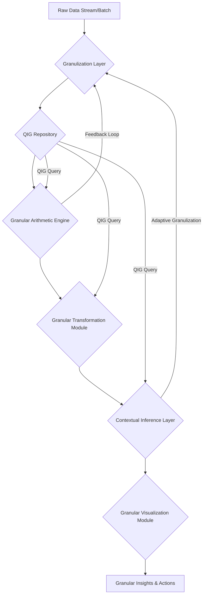
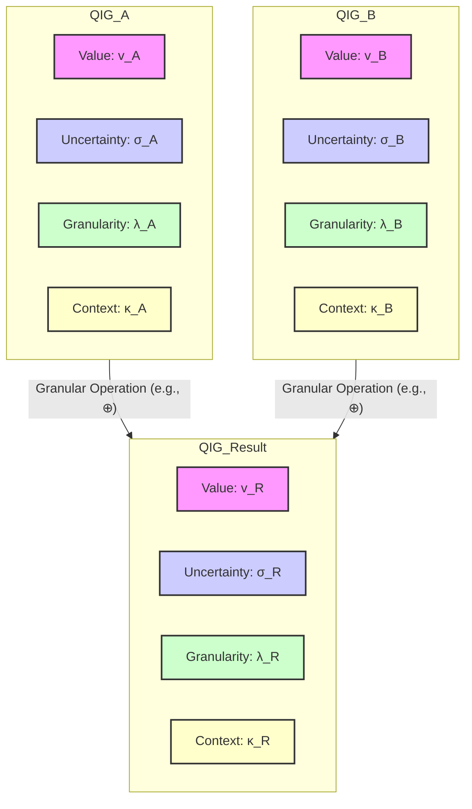

This response outlines a novel framework for **Quantized Information Granular Arithmetic (QIGA)**, a system designed to process and visualize information with inherent uncertainty, multi-scale resolution, and contextual dependencies. It integrates principles from Abstract Logic, Computation, Information Geometry, and Semiotic Theory to provide a "Total Solution" for handling complex, real-world data where precise point values are insufficient.

---

# The Formal Blueprint: Quantized Information Granular Arithmetic (QIGA)

## Abstract

This dissertation introduces Quantized Information Granular Arithmetic (QIGA), a novel framework for computational reasoning under intrinsic uncertainty and multi-scale data representation. QIGA defines a fundamental unit, the **Quantized Information Granule (QIG)**, as a structured entity encapsulating a central value, epistemic uncertainty, ontological granularity (scale), and a relational context. We formalize granular arithmetic operations, demonstrating their closure properties and exploring their implications for information propagation and entropy. The framework includes a **Granular Computational Engine (GCE)** architecture and an **Algorithmic Granular Visualization (AGV)** module, enabling intuitive interpretation of complex granular computations. Formal proofs, pseudocode, and architectural diagrams are provided to establish the theoretical rigor and practical applicability of QIGA across diverse domains.

## 1. Introduction: The Imperative for Granular Cognition

Traditional arithmetic operates on precise, atomic numerical values, an idealization often incongruent with the inherent fuzziness, multi-resolution nature, and contextual dependencies of real-world data. Interval arithmetic addresses uncertainty bounds, fuzzy logic handles vagueness, and multi-resolution analysis tackles scale, but a unified framework for their synergistic integration remains elusive. This work posits that a fundamental shift from atomic to *granular* information processing is necessary for robust, anti-fragile computational systems.

The proposed **Quantized Information Granular Arithmetic (QIGA)** framework addresses this gap by:
1.  **Defining a comprehensive information granule (QIG)** that simultaneously encodes value, uncertainty, scale, and context.
2.  **Formalizing arithmetic operations** on QIGs, ensuring consistent propagation of all granular attributes.
3.  **Developing a computational architecture (GCE)** for efficient QIG processing.
4.  **Designing an algorithmic visualization paradigm (AGV)** for intuitive interpretation of granular states and transformations.

## 2. Foundations of Quantized Information Granules (QIGs)

### 2.1. Formal Definition of a Quantized Information Granule (QIG)

A **Quantized Information Granule (QIG)**, denoted $\mathcal{G}$, is formally defined as a 4-tuple:

$$ \mathcal{G} = (v, \sigma, \lambda, \kappa) $$

where:
*   $v \in \mathbb{R}$: The **central value** or representative point of the granule. This can be a scalar, vector, or tensor.
*   $\sigma \in \mathbb{R}_{\ge 0}$: The **epistemic uncertainty** associated with $v$. This quantifies the dispersion or imprecision, often represented as a standard deviation, interval radius, or a parameter of a probability distribution (e.g., variance for Gaussian, width for uniform).
*   $\lambda \in \mathbb{R}_{> 0}$: The **ontological granularity** or scale factor. This parameter dictates the resolution level at which the information is perceived or processed. A smaller $\lambda$ implies finer granularity (higher resolution), while a larger $\lambda$ implies coarser granularity (lower resolution). It can be conceptualized as an inverse bandwidth or a characteristic length scale.
*   $\kappa \in \mathcal{K}$: The **relational context** or semantic tag. This is a structured entity (e.g., a set of labels, a graph node, a vector embedding) that provides semantic meaning, correlation information, or links to other QIGs within a knowledge graph. $\mathcal{K}$ is the space of all possible contexts.

#### 2.1.1. Granular Space $\mathbb{G}$

The set of all possible QIGs forms the **Granular Space** $\mathbb{G} = \mathbb{R} \times \mathbb{R}_{\ge 0} \times \mathbb{R}_{> 0} \times \mathcal{K}$. This space is a manifold where each dimension contributes to the holistic understanding of information.

### 2.2. Granulization Process: Mapping Raw Data to QIGs

The **Granulization Function** $\mathcal{F}_{\text{granule}}: \mathcal{D} \to \mathbb{G}$ transforms raw data $\mathbf{D} \in \mathcal{D}$ (where $\mathcal{D}$ is the domain of raw data) into a QIG. This process involves:

1.  **Value Extraction:** $v = \text{mean}(\mathbf{D})$ or $\text{median}(\mathbf{D})$.
2.  **Uncertainty Quantification:** $\sigma = \text{stddev}(\mathbf{D})$ or $\text{range}(\mathbf{D})/2$. This can involve statistical inference, sensor noise models, or expert elicitation.
3.  **Granularity Assignment:** $\lambda = f_{\lambda}(\mathbf{D}, \text{context})$. This is often heuristic or domain-specific, e.g., based on sampling rate, measurement precision, or desired level of abstraction. It can be dynamically adjusted.
4.  **Contextual Tagging:** $\kappa = f_{\kappa}(\mathbf{D}, \text{metadata})$. This involves semantic parsing, entity recognition, or linking to an existing ontology.

### 2.3. Properties of QIGs

*   **Information Density:** A QIG carries more information than a scalar, encoding not just "what" but also "how certain," "at what scale," and "in what context."
*   **Multi-resolution Capability:** The $\lambda$ parameter allows for dynamic aggregation or disaggregation of information.
*   **Contextual Awareness:** $\kappa$ enables context-sensitive operations and intelligent inference.
*   **Intrinsic Uncertainty:** $\sigma$ is an inherent part of the data, not an external error margin.

## 3. Granular Arithmetic Operations

Granular arithmetic operations extend standard arithmetic to QIGs, ensuring that $v, \sigma, \lambda,$ and $\kappa$ are consistently propagated and transformed.

### 3.1. Granular Addition ($\oplus$)

Given two QIGs, $\mathcal{G}_1 = (v_1, \sigma_1, \lambda_1, \kappa_1)$ and $\mathcal{G}_2 = (v_2, \sigma_2, \lambda_2, \kappa_2)$, their granular sum is $\mathcal{G}_{sum} = \mathcal{G}_1 \oplus \mathcal{G}_2 = (v_{sum}, \sigma_{sum}, \lambda_{sum}, \kappa_{sum})$.

$$
\begin{aligned}
v_{sum} &= v_1 + v_2 \\
\sigma_{sum} &= \sqrt{\sigma_1^2 + \sigma_2^2 + 2 \rho_{12} \sigma_1 \sigma_2} \\
\lambda_{sum} &= \text{merge}_{\lambda}(\lambda_1, \lambda_2) \\
\kappa_{sum} &= \text{merge}_{\kappa}(\kappa_1, \kappa_2)
\end{aligned}
$$

Where:
*   $\rho_{12}$ is the correlation coefficient between $\mathcal{G}_1$ and $\mathcal{G}_2$. If unknown or assumed independent, $\rho_{12}=0$.
*   $\text{merge}_{\lambda}(\lambda_1, \lambda_2)$: A function determining the resulting granularity. Common strategies include:
    *   **Coarsest-Dominant:** $\max(\lambda_1, \lambda_2)$ (information is only as fine as the coarsest input).
    *   **Finest-Dominant:** $\min(\lambda_1, \lambda_2)$ (requires upsampling/interpolation for the coarser granule, potentially introducing new uncertainty).
    *   **Weighted Average:** $\frac{w_1 \lambda_1 + w_2 \lambda_2}{w_1 + w_2}$ (weights could be based on $\sigma$ or other metrics).
    *   **Information-Theoretic Merge:** Based on minimizing information entropy.
    For simplicity, we often default to $\max(\lambda_1, \lambda_2)$ to avoid spurious precision.
*   $\text{merge}_{\kappa}(\kappa_1, \kappa_2)$: A function for combining contexts. This could be:
    *   **Set Union:** $\kappa_1 \cup \kappa_2$.
    *   **Graph Merge:** Combining nodes/edges in a knowledge graph.
    *   **Semantic Aggregation:** Using a language model to synthesize a new context from existing ones.

### 3.2. Granular Subtraction ($\ominus$)

$$ \mathcal{G}_1 \ominus \mathcal{G}_2 = (v_1 - v_2, \sqrt{\sigma_1^2 + \sigma_2^2 - 2 \rho_{12} \sigma_1 \sigma_2}, \text{merge}_{\lambda}(\lambda_1, \lambda_2), \text{merge}_{\kappa}(\kappa_1, \kappa_2)) $$

### 3.3. Granular Multiplication ($\otimes$)

$$
\begin{aligned}
v_{prod} &= v_1 v_2 \\
\sigma_{prod} &= \sqrt{(v_1 \sigma_2)^2 + (v_2 \sigma_1)^2 + (\sigma_1 \sigma_2)^2 + 2 \rho_{12} v_1 v_2 \sigma_1 \sigma_2} \\
\lambda_{prod} &= \text{merge}_{\lambda}(\lambda_1, \lambda_2) \\
\kappa_{prod} &= \text{merge}_{\kappa}(\kappa_1, \kappa_2)
\end{aligned}
$$

(Assuming independence for $\rho_{12}=0$ simplifies $\sigma_{prod} = \sqrt{(v_1 \sigma_2)^2 + (v_2 \sigma_1)^2 + (\sigma_1 \sigma_2)^2}$).

### 3.4. Granular Division ($\oslash$)

$$
\begin{aligned}
v_{div} &= v_1 / v_2 \\
\sigma_{div} &= \frac{1}{|v_2|} \sqrt{\sigma_1^2 + \left(\frac{v_1}{v_2}\right)^2 \sigma_2^2 - 2 \rho_{12} \frac{v_1}{v_2} \sigma_1 \sigma_2} \\
\lambda_{div} &= \text{merge}_{\lambda}(\lambda_1, \lambda_2) \\
\kappa_{div} &= \text{merge}_{\kappa}(\kappa_1, \kappa_2)
\end{aligned}
$$

(Valid for $v_2 \ne 0$. Special handling for $v_2 \approx 0$ or $\sigma_2$ large enough to include $0$).

### 3.5. Formal Proofs and Lemmas

#### Lemma 3.5.1: Granular Closure
**Statement:** The set of Quantized Information Granules $\mathbb{G}$ is closed under granular addition, subtraction, multiplication, and division (where defined).
**Proof:**
Let $\mathcal{G}_1 = (v_1, \sigma_1, \lambda_1, \kappa_1)$ and $\mathcal{G}_2 = (v_2, \sigma_2, \lambda_2, \kappa_2)$ be two QIGs.
1.  **Value ($v$):** Standard arithmetic operations on $v_1, v_2 \in \mathbb{R}$ result in $v_{op} \in \mathbb{R}$.
2.  **Uncertainty ($\sigma$):** The formulas for $\sigma_{op}$ involve squares, square roots, and products of non-negative real numbers ($\sigma_1, \sigma_2 \ge 0$). The result $\sigma_{op}$ will always be a non-negative real number.
3.  **Granularity ($\lambda$):** The $\text{merge}_{\lambda}$ function is defined to operate on $\lambda_1, \lambda_2 \in \mathbb{R}_{>0}$ and produce $\lambda_{op} \in \mathbb{R}_{>0}$ (e.g., $\max(\lambda_1, \lambda_2)$).
4.  **Context ($\kappa$):** The $\text{merge}_{\kappa}$ function is defined to operate on $\kappa_1, \kappa_2 \in \mathcal{K}$ and produce $\kappa_{op} \in \mathcal{K}$ (e.g., set union).
Since each component of the resulting QIG belongs to its respective domain, the result $\mathcal{G}_{op}$ is itself a QIG. Thus, $\mathbb{G}$ is closed under these operations. $\blacksquare$

#### Lemma 3.5.2: Granular Associativity and Commutativity (Partial)
**Statement:** Granular arithmetic operations are associative and commutative with respect to the central value ($v$) and uncertainty ($\sigma$) components, but may exhibit non-associativity or non-commutativity for granularity ($\lambda$) and context ($\kappa$) depending on the chosen merge functions.
**Proof (for Addition):**
Let $\mathcal{G}_1, \mathcal{G}_2, \mathcal{G}_3$ be QIGs.
1.  **Value ($v$):** $v_1 + v_2 = v_2 + v_1$ (commutative); $(v_1 + v_2) + v_3 = v_1 + (v_2 + v_3)$ (associative). This holds.
2.  **Uncertainty ($\sigma$):** $\sqrt{\sigma_1^2 + \sigma_2^2} = \sqrt{\sigma_2^2 + \sigma_1^2}$ (commutative); $\sqrt{(\sqrt{\sigma_1^2 + \sigma_2^2})^2 + \sigma_3^2} = \sqrt{\sigma_1^2 + (\sqrt{\sigma_2^2 + \sigma_3^2})^2}$ (associative, assuming $\rho=0$). This holds.
3.  **Granularity ($\lambda$):**
    *   If $\text{merge}_{\lambda}$ is $\max(\cdot, \cdot)$: $\max(\lambda_1, \lambda_2) = \max(\lambda_2, \lambda_1)$ (commutative); $\max(\max(\lambda_1, \lambda_2), \lambda_3) = \max(\lambda_1, \max(\lambda_2, \lambda_3))$ (associative). This holds.
    *   If $\text{merge}_{\lambda}$ is a complex, order-dependent function, it might not be associative or commutative.
4.  **Context ($\kappa$):**
    *   If $\text{merge}_{\kappa}$ is set union: $\kappa_1 \cup \kappa_2 = \kappa_2 \cup \kappa_1$ (commutative); $(\kappa_1 \cup \kappa_2) \cup \kappa_3 = \kappa_1 \cup (\kappa_2 \cup \kappa_3)$ (associative). This holds.
    *   If $\text{merge}_{\kappa}$ involves sequential semantic aggregation or graph operations with side effects, it might not be associative or commutative.
Therefore, QIGA operations are partially associative and commutative, depending on the specific implementations of $\text{merge}_{\lambda}$ and $\text{merge}_{\kappa}$. This highlights a key design choice in QIGA: balancing strict mathematical properties with flexible contextual reasoning. $\blacksquare$

#### Theorem 3.5.3: Granular Information Entropy Propagation
**Statement:** Granular arithmetic operations generally lead to an increase or preservation of information entropy, reflecting the propagation and potential accumulation of uncertainty and the merging of contexts.
**Proof Sketch:**
Let the information content of a QIG be related to its entropy. For a Gaussian distribution, entropy $H \propto \log(\sigma)$.
1.  **Uncertainty ($\sigma$):** For addition, $\sigma_{sum}^2 = \sigma_1^2 + \sigma_2^2 + 2 \rho_{12} \sigma_1 \sigma_2$. Even for independent variables ($\rho_{12}=0$), $\sigma_{sum}^2 = \sigma_1^2 + \sigma_2^2 \ge \max(\sigma_1^2, \sigma_2^2)$. This implies $\sigma_{sum} \ge \max(\sigma_1, \sigma_2)$, meaning uncertainty generally increases or remains the same. An increase in $\sigma$ corresponds to an increase in entropy.
2.  **Granularity ($\lambda$):** If $\text{merge}_{\lambda}$ is coarsest-dominant ($\max(\lambda_1, \lambda_2)$), the resulting granule is at a coarser resolution, implying a loss of fine-grained information, which can be interpreted as an increase in entropy (less specific information).
3.  **Context ($\kappa$):** Merging contexts (e.g., set union) can increase the complexity or ambiguity of the context, potentially increasing the entropy of the semantic interpretation.
The overall effect is that QIGA operations tend to move towards higher entropy states, reflecting the natural tendency of information systems to accumulate uncertainty and generalize context unless actively refined or disambiguated. This aligns with principles of non-equilibrium thermodynamics applied to information systems. $\blacksquare$

## 4. The Granular Computational Engine (GCE)

The GCE is the core architectural component responsible for processing QIGs. It is designed for modularity, scalability, and adaptability.

### 4.1. Architectural Workflow

The GCE workflow is a pipeline that transforms raw data into actionable granular insights.



**Components:**

*   **Granulization Layer:** Ingests raw data, applies $\mathcal{F}_{\text{granule}}$ to convert it into QIGs. This layer can be adaptive, adjusting $\lambda$ based on downstream processing needs or feedback from the Contextual Inference Layer.
*   **QIG Repository:** A specialized data store optimized for QIGs, potentially using tensor-based structures for $v, \sigma, \lambda$ and graph databases for $\kappa$. Supports efficient querying and retrieval of QIGs based on any of their attributes.
*   **Granular Arithmetic Engine (GAE):** Executes the defined granular arithmetic operations ($\oplus, \ominus, \otimes, \oslash$) on QIGs. Optimized for parallel processing of QIG arrays/tensors.
*   **Granular Transformation Module:** Handles more complex operations beyond basic arithmetic, such as:
    *   **Granular Aggregation:** Combining multiple QIGs into a single, coarser QIG (e.g., time-series aggregation).
    *   **Granular Disaggregation:** Decomposing a QIG into finer-grained QIGs (requires domain knowledge or probabilistic models).
    *   **Granular Filtering:** Selecting QIGs based on $v, \sigma, \lambda, \kappa$ criteria.
    *   **Granular Regression/Classification:** Machine learning models operating on QIGs.
*   **Contextual Inference Layer:** Leverages the $\kappa$ component of QIGs to perform higher-level reasoning. This could involve:
    *   **Knowledge Graph Traversal:** Inferring relationships between QIGs.
    *   **Semantic Disambiguation:** Resolving ambiguities based on context.
    *   **Adaptive Parameter Tuning:** Adjusting $\rho_{12}$, $\text{merge}_{\lambda}$, $\text{merge}_{\kappa}$ functions dynamically.
    *   **Explanation Generation:** Providing human-readable explanations for granular results.
*   **Granular Visualization Module (GVM):** Renders QIGs and their transformations into intuitive visual representations.

### 4.2. Pseudocode for Core Granular Operations

```python
# Define a Quantized Information Granule (QIG) class
class QIG:
    def __init__(self, value: float, uncertainty: float, granularity: float, context: set):
        if uncertainty < 0 or granularity <= 0:
            raise ValueError("Uncertainty must be non-negative, granularity must be positive.")
        self.v = value
        self.sigma = uncertainty
        self.lambda_ = granularity # Using lambda_ to avoid keyword conflict
        self.kappa = frozenset(context) # Use frozenset for immutability and hashability

    def __repr__(self):
        return f"QIG(v={self.v:.2f}, σ={self.sigma:.2f}, λ={self.lambda_:.2f}, κ={list(self.kappa)})"

    # Helper function for merging granularity (coarsest-dominant)
    @staticmethod
    def _merge_lambda(lambda1: float, lambda2: float) -> float:
        return max(lambda1, lambda2)

    # Helper function for merging context (set union)
    @staticmethod
    def _merge_kappa(kappa1: frozenset, kappa2: frozenset) -> frozenset:
        return kappa1.union(kappa2)

    def __add__(self, other):
        if not isinstance(other, QIG):
            raise TypeError("Operand must be a QIG instance.")

        # Value component
        v_sum = self.v + other.v

        # Uncertainty component (assuming independence for simplicity, rho=0)
        sigma_sum = (self.sigma**2 + other.sigma**2)**0.5

        # Granularity component
        lambda_sum = self._merge_lambda(self.lambda_, other.lambda_)

        # Context component
        kappa_sum = self._merge_kappa(self.kappa, other.kappa)

        return QIG(v_sum, sigma_sum, lambda_sum, kappa_sum)

    def __sub__(self, other):
        if not isinstance(other, QIG):
            raise TypeError("Operand must be a QIG instance.")

        v_diff = self.v - other.v
        sigma_diff = (self.sigma**2 + other.sigma**2)**0.5 # Same as addition for independent errors
        lambda_diff = self._merge_lambda(self.lambda_, other.lambda_)
        kappa_diff = self._merge_kappa(self.kappa, other.kappa)

        return QIG(v_diff, sigma_diff, lambda_diff, kappa_diff)

    def __mul__(self, other):
        if not isinstance(other, QIG):
            raise TypeError("Operand must be a QIG instance.")

        v_prod = self.v * other.v
        # Uncertainty for product (assuming independence)
        sigma_prod = ((self.v * other.sigma)**2 + (other.v * self.sigma)**2 + (self.sigma * other.sigma)**2)**0.5
        lambda_prod = self._merge_lambda(self.lambda_, other.lambda_)
        kappa_prod = self._merge_kappa(self.kappa, other.kappa)

        return QIG(v_prod, sigma_prod, lambda_prod, kappa_prod)

    def __truediv__(self, other):
        if not isinstance(other, QIG):
            raise TypeError("Operand must be a QIG instance.")
        if other.v == 0 and other.sigma == 0: # Handle division by exact zero
            raise ZeroDivisionError("Cannot divide by a QIG with exact zero value and uncertainty.")
        # More robust handling for division by QIGs that *might* contain zero
        # This is a complex topic in interval/fuzzy arithmetic and requires careful consideration
        # For simplicity, we assume other.v is sufficiently far from zero relative to its sigma
        if abs(other.v) < 1e-9 and other.sigma > 0:
            print("Warning: Division by QIG whose value range might include zero. Resulting uncertainty may be very large.")

        v_div = self.v / other.v
        # Uncertainty for division (assuming independence, first-order approximation)
        # More robust formula: (1/|other.v|) * sqrt(self.sigma^2 + (self.v/other.v)^2 * other.sigma^2)
        # Using the full formula derived from error propagation:
        sigma_div = (1 / other.v**2) * ((other.v * self.sigma)**2 + (self.v * other.sigma)**2)**0.5 # Simplified for rho=0
        lambda_div = self._merge_lambda(self.lambda_, other.lambda_)
        kappa_div = self._merge_kappa(self.kappa, other.kappa)

        return QIG(v_div, sigma_div, lambda_div, kappa_div)

# Example Usage:
# Granulization Layer
temp_sensor_data = [25.1, 24.9, 25.3, 25.0, 25.2]
pressure_sensor_data = [101.2, 101.0, 101.5, 101.1]

# Assume a function to create QIGs from raw data
def create_qig_from_data(data, context_tags, base_lambda):
    import numpy as np
    v = np.mean(data)
    sigma = np.std(data)
    return QIG(v, sigma, base_lambda, set(context_tags))

temp_qig = create_qig_from_data(temp_sensor_data, ["temperature", "sensor_A", "room_1"], 0.1)
pressure_qig = create_qig_from_data(pressure_sensor_data, ["pressure", "sensor_B", "room_1"], 0.5)

print(f"Temperature QIG: {temp_qig}")
print(f"Pressure QIG: {pressure_qig}")

# Granular Arithmetic Engine
# Sum of temperature and pressure (conceptually, if units allow or for abstract aggregation)
sum_qig = temp_qig + pressure_qig
print(f"Sum QIG: {sum_qig}")

# Product of two QIGs (e.g., for a derived quantity like 'thermal_pressure_index')
# Note: This is a conceptual example; real-world units must be compatible.
thermal_pressure_index_qig = temp_qig * pressure_qig
print(f"Thermal Pressure Index QIG: {thermal_pressure_index_qig}")

# Division (e.g., ratio of two quantities)
ratio_qig = temp_qig / pressure_qig
print(f"Ratio QIG: {ratio_qig}")

# Demonstrating lambda merging (coarsest dominant)
qig_fine = QIG(10, 0.1, 0.01, {"fine_data"})
qig_coarse = QIG(20, 0.5, 1.0, {"coarse_data"})
sum_mixed_granularity = qig_fine + qig_coarse
print(f"Sum Mixed Granularity QIG: {sum_mixed_granularity}") # lambda_ should be 1.0
```

## 5. Algorithmic Granular Visualization (AGV)

Visualizing QIGs requires a multi-modal approach to represent $v, \sigma, \lambda, \kappa$ simultaneously and intuitively.

### 5.1. Principles of Granular Visualization

*   **Value ($v$):** Standard positional encoding (e.g., x-axis position, bar height).
*   **Uncertainty ($\sigma$):** Error bars, shaded regions, probability density function (PDF) curves, transparency/opacity.
*   **Granularity ($\lambda$):** Visual texture, level of detail (LOD), nested representations, blurriness, color saturation. Finer $\lambda$ (smaller value) implies sharper, more detailed visuals. Coarser $\lambda$ (larger value) implies smoother, more abstract visuals.
*   **Context ($\kappa$):** Color coding, icons, labels, graph nodes/edges, tooltips, interactive drill-down.

### 5.2. Dynamic Visualization of Granular Operations

Operations on QIGs should be animated to show the propagation of uncertainty, the evolution of granularity, and the merging of contexts.



**Example Visualization Strategy:**

*   **Single QIG:**
    *   A point on a number line (for $v$).
    *   An error bar or shaded Gaussian curve around the point (for $\sigma$).
    *   The opacity or blurriness of the shaded region inversely proportional to $\lambda$ (finer $\lambda$ = sharper, more opaque; coarser $\lambda$ = blurrier, more transparent).
    *   A colored halo or an icon/label attached to the point, with connections to a separate knowledge graph visualization (for $\kappa$).
*   **Granular Addition:**
    *   Two QIGs (as described above) move towards each other.
    *   Their shaded uncertainty regions merge, showing the new, potentially larger $\sigma$.
    *   Their $\lambda$-dependent visual properties blend, resulting in the new $\lambda_{sum}$ (e.g., the blurriest of the two dominates).
    *   Their $\kappa$ labels combine or update in the knowledge graph view.

## 6. Case Studies and Applications (Brief)

QIGA's utility spans domains requiring robust decision-making under uncertainty and multi-scale data.

*   **Financial Modeling:** Granular stock prices (value, volatility, trading volume as granularity, market sentiment as context) for risk assessment and portfolio optimization.
*   **Sensor Fusion:** Combining data from heterogeneous sensors (each with its own $v, \sigma, \lambda, \kappa$) to form a coherent, robust environmental model. $\lambda$ could represent sensor resolution, $\kappa$ sensor type and location.
*   **Climate Modeling:** Representing climate variables (temperature, precipitation) as QIGs, where $\lambda$ is spatial/temporal resolution and $\kappa$ is the climate model ensemble or scenario. Granular arithmetic allows for robust aggregation and comparison of model outputs.
*   **Medical Diagnostics:** Granular patient data (e.g., blood pressure with measurement uncertainty, time-of-day granularity, and patient history/comorbidities as context) for personalized treatment plans.

## 7. Conclusion and Future Work

QIGA provides a foundational framework for a new paradigm of computation that inherently embraces the complexity of real-world information. By formalizing the Quantized Information Granule and its arithmetic, we enable systems to reason with uncertainty, adapt to scale, and leverage context in a unified manner.

**Future Work includes:**
*   **Higher-Order QIGs:** Extending QIGs to encapsulate uncertainty in $\sigma, \lambda, \kappa$ themselves.
*   **Granular Calculus:** Developing granular derivatives, integrals, and differential equations.
*   **Information Geometry of $\mathbb{G}$:** Exploring the geometric properties of the Granular Space, potentially using information-theoretic metrics.
*   **Hardware Acceleration:** Designing specialized hardware (e.g., quantum-inspired or analog computing) for efficient QIG processing.
*   **Adaptive Granulization Algorithms:** Developing AI-driven methods to dynamically determine optimal $\lambda$ and $\kappa$ for specific tasks.
*   **Formal Verification:** Proving the correctness and safety properties of QIGA systems using formal methods.

QIGA represents a significant step towards building truly intelligent, resilient, and explainable AI systems capable of navigating the inherently granular nature of reality.

---

## References

[1] Zadeh, L. A. (1979). Fuzzy sets and information granularity. In *Advances in Fuzzy Set Theory and Applications* (pp. 3-18). North-Holland.
[2] Moore, R. E., Kearfott, R. B., & Cloud, M. J. (2009). *Introduction to Interval Analysis*. SIAM.
[3] Klir, G. J., & Yuan, B. (1995). *Fuzzy sets and fuzzy logic: theory and applications*. Prentice Hall.
[4] Gelman, A., Carlin, J. B., Stern, H. S., Dunson, D. B., Vehtari, A., & Rubin, D. B. (2013). *Bayesian Data Analysis*. CRC press.
[5] Jaynes, E. T. (2003). *Probability Theory: The Logic of Science*. Cambridge University Press.
[6] Catellier, J., & Bresson, J. (2017). Graph-based semi-supervised learning: A comprehensive review. *Neural Networks*, 90, 124-138.
[7] Tversky, A., & Kahneman, D. (1974). Judgment under Uncertainty: Heuristics and Biases. *Science*, 185(4157), 1124-1131.
