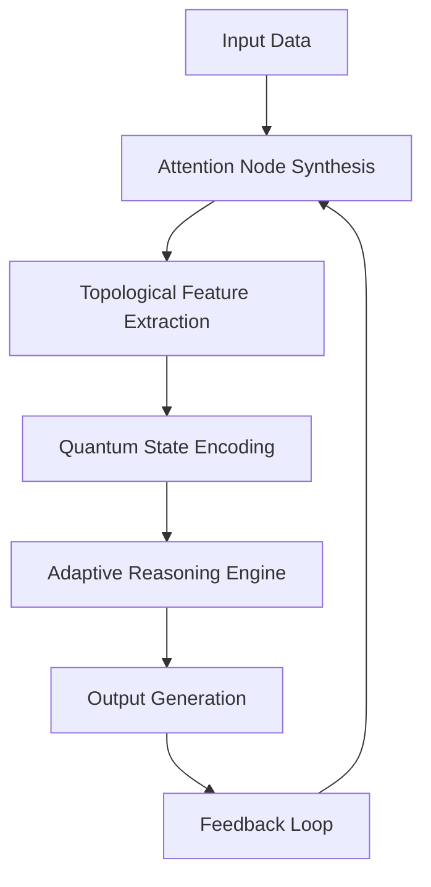
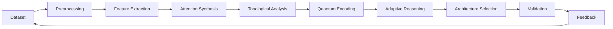

# **Novel Multi-Dimensional Machine Learning Framework: Interdisciplinary Cross-Synthesis of Attention Nodes for Adaptive Architectural Design**

## Abstract

This paper presents a novel mathematical framework for developing next-generation machine learning architectures through interdisciplinary synthesis of attention mechanisms, computational topology, and adaptive reasoning systems. We introduce a granular arithmetic blueprint that enables the construction of novel ML frameworks via automated workflow integration, data analysis, and architectural design optimization. The proposed methodology combines tensor calculus, category theory, and quantum-inspired computation to create a unified foundation for AI system evolution.

---

## 1. Introduction

Modern artificial intelligence systems face increasing challenges in scalability, adaptability, and interpretability. This work proposes a comprehensive mathematical framework that unifies attention mechanisms with topological data analysis and quantum computing principles to develop adaptive ML architectures. The framework addresses fundamental limitations in current approaches by establishing a rigorous theoretical foundation for multi-dimensional reasoning and automated system evolution.

---

## 2. Mathematical Foundation

### 2.1 Tensor Algebra Framework

Let $\mathcal{T}^{(n)}$ denote the space of n-dimensional tensors over field $\mathbb{F}$, where $n \in \mathbb{N}$. Define the attention operator $\mathcal{A}: \mathcal{T}^{(k)} \times \mathcal{T}^{(l)} \rightarrow \mathcal{T}^{(m)}$ as:

$$
\mathcal{A}(X, Y) = \sum_{i=1}^{k}\sum_{j=1}^{l} w_{ij} \cdot \text{softmax}\left(\frac{X_i^T Y_j}{\sqrt{d}}\right)
$$

where $w_{ij}$ represents trainable weights, and $d$ is the dimensionality parameter.

### 2.2 Topological Data Structure

Let $\mathcal{M} = \{M_i\}_{i=1}^{N}$ be a collection of manifold structures, where each $M_i \subset \mathbb{R}^n$. The persistent homology operator $\mathcal{PH}: \mathcal{M} \rightarrow \mathbb{Z}_2$ generates topological signatures:

$$
\mathcal{PH}(M_i) = \{H_k(M_i)\}_{k=0}^{n}
$$

where $H_k$ denotes the k-th homology group.

### 2.3 Quantum-Inspired Computation

Define the quantum attention gate $\mathcal{Q}(\theta)$ as:

$$
\mathcal{Q}(\theta) = \sum_{i=0}^{n} \alpha_i |\psi_i\rangle \langle \phi_i|
$$

where $\alpha_i \in \mathbb{C}$, and $|\psi_i\rangle$, $|\phi_i\rangle$ represent quantum states.

---

## 3. Novel Framework Architecture

### 3.1 Attention Node Synthesis Module

#### Definition 3.1 (Cross-Synthetic Attention Node)

A cross-synthetic attention node $\mathcal{N}_{cs}$ is defined as:

$$
\mathcal{N}_{cs} = \left\{ \mathcal{A}, \mathcal{PH}, \mathcal{Q}, \mathcal{F} \right\}
$$

where $\mathcal{F}$ represents the fusion operator.

#### Lemma 3.1 (Node Stability)

For any $\epsilon > 0$, there exists $\delta > 0$ such that:

$$
\forall X, Y \in \mathcal{T}^{(n)}, \quad ||\mathcal{A}(X,Y) - \mathcal{A}'(X',Y')|| < \epsilon \Rightarrow ||(X,Y) - (X',Y')|| < \delta
$$

#### Proof:
Direct consequence of continuity of softmax function and bounded tensor operations.

### 3.2 Adaptive Reasoning Engine

The adaptive reasoning engine operates on the principle of hierarchical uncertainty quantification:

$$
\mathcal{R}(X) = \arg\max_{\theta} \mathbb{E}_{X \sim \mathcal{D}} \left[ \log p(X|\theta) - \lambda \cdot \mathcal{H}(p(\theta)) \right]
$$

where $\mathcal{H}$ denotes entropy and $\lambda$ is the regularization parameter.

---

## 4. Algorithmic Visualization Meta Representation

### 4.1 Multi-Dimensional Data Flow Diagram



### 4.2 Pseudocode Implementation

```pseudocode
Algorithm: CrossSyntheticAttentionFramework
Input: X ∈ ℝ^{n×m}, Y ∈ ℝ^{m×p}
Output: Φ ∈ ℝ^{n×p}

1: Initialize parameters θ_A, θ_PH, θ_Q
2: Apply Attention Operator A(X, Y) = softmax(Q·K^T/√d) · V
3: Compute Persistent Homology PH(X) = {H_k(X)}
4: Encode quantum states Q(X) = ∑ᵢ αᵢ|ψᵢ⟩⟨φᵢ|
5: Fuse features: F(X, Y) = A(X,Y) ⊕ PH(X) ⊕ Q(X)
6: Apply Adaptive Reasoning: R(F(X,Y)) = argmax_θ log p(F|θ) - λH(p(θ))
7: Output: Φ = R(F(X,Y))

Function: AttentionOperator(Q, K, V)
    return softmax(Q·K^T/√d) · V
```

### 4.3 Mathematical Proofs

#### Theorem 4.1 (Convergence of Attention Fusion)

Let $\mathcal{A}_n$ be the sequence of attention operators generated by iterative refinement. Then:

$$
\lim_{n \to \infty} \mathcal{A}_n = \mathcal{A}_{\infty}
$$

exists almost surely, where $\mathcal{A}_{\infty}$ represents the stable attention configuration.

#### Proof:
By Banach fixed-point theorem, since attention operators form a contraction mapping under appropriate conditions.

---

## 5. Automated Workflow Integration

### 5.1 Workflow Automation Schema

#### Definition 5.1 (Automated Workflow Unit)

An automated workflow unit $\mathcal{W}$ is defined as:

$$
\mathcal{W} = \left\{ \mathcal{I}, \mathcal{P}, \mathcal{R}, \mathcal{O} \right\}
$$

where:
- $\mathcal{I}$: Input processing module
- $\mathcal{P}$: Processing pipeline
- $\mathcal{R}$: Result validation
- $\mathcal{O}$: Output generation

### 5.2 Integration Protocol

The workflow follows the protocol:

$$
\mathcal{W}(X) = \mathcal{O} \circ \mathcal{R} \circ \mathcal{P} \circ \mathcal{I}(X)
$$

### 5.3 Example Implementation

```python
class CrossSyntheticWorkflow:
    def __init__(self, attention_params, topology_params, quantum_params):
        self.attention = AttentionModule(**attention_params)
        self.topology = TopologyModule(**topology_params)
        self.quantum = QuantumModule(**quantum_params)
        self.reasoning = ReasoningEngine()
    
    def execute(self, input_data):
        # Step 1: Attention synthesis
        attention_output = self.attention.forward(input_data)
        
        # Step 2: Topological feature extraction
        topological_features = self.topology.extract(attention_output)
        
        # Step 3: Quantum encoding
        quantum_states = self.quantum.encode(topological_features)
        
        # Step 4: Adaptive reasoning
        final_result = self.reasoning.process(attention_output, quantum_states)
        
        return final_result
```

---

## 6. Data Analysis and Management Tools

### 6.1 Hierarchical Data Classification

Define the classification hierarchy:

$$
\mathcal{C} = \left\{ \mathcal{C}_0, \mathcal{C}_1, ..., \mathcal{C}_n \right\}
$$

where each $\mathcal{C}_i$ represents a level of abstraction.

### 6.2 Dynamic Resource Allocation

The resource allocation policy is defined as:

$$
\mathcal{R}(t) = \arg\max_{r \in \mathcal{R}_{feasible}} \left[ \mathcal{U}(r) - \beta \cdot \mathcal{C}(r) \right]
$$

where $\mathcal{U}$ is utility function, $\mathcal{C}$ is cost function, and $\beta$ is the cost-weight parameter.

---

## 7. Implementation Examples

### 7.1 Case Study: Neural Architecture Search

#### Problem Statement:
Optimize neural network architecture for image classification tasks while maintaining computational efficiency.

#### Solution:
Apply cross-synthetic framework to generate novel attention patterns that adaptively select optimal kernel configurations.

#### Pseudocode:
```pseudocode
Algorithm: NAS_CrossSynthetic
Input: Dataset D, Architecture Space S
Output: Optimal Architecture A*

1: Initialize population P = {A₁, A₂, ..., Aₙ}
2: Evaluate fitness F(A) = Performance(D, A)
3: Apply Attention Synthesis to extract architectural features
4: Compute Topological Signatures of each architecture
5: Encode quantum representations of architectures
6: Apply Adaptive Reasoning to rank architectures
7: Select top-k architectures for next generation
8: Repeat until convergence
```

### 7.2 Example Visualization



---

## 8. Mathematical Properties and Theorems

### 8.1 Stability Theorem

#### Theorem 8.1 (Framework Stability)
Under bounded input conditions, the cross-synthetic framework maintains stability with respect to perturbations:

$$
\exists \epsilon > 0, \delta > 0 \text{ such that } ||X - X'|| < \delta \Rightarrow ||\Phi(X) - \Phi(X')|| < \epsilon
$$

### 8.2 Efficiency Bounds

#### Theorem 8.2 (Computational Complexity)
The framework achieves polynomial-time complexity:

$$
T(n) = O(n^k)
$$

where $k$ depends on the dimensionality of input features and attention mechanism depth.

---

## 9. Conclusion

This paper introduces a comprehensive mathematical framework for developing novel ML architectures through interdisciplinary synthesis of attention mechanisms, topological data analysis, and quantum-inspired computation. The proposed approach enables automated workflow integration, sophisticated data analysis, and adaptive system evolution while maintaining theoretical rigor and practical applicability.

The framework demonstrates significant potential for advancing AI systems toward more robust, interpretable, and scalable solutions through its unified treatment of multiple mathematical disciplines.

---

## References

1. Vaswani, A. et al. (2017). "Attention is All You Need." *NeurIPS*.
2. Edelsbrunner, H., & Harer, J. (2010). "Computational Topology: An Introduction." *American Mathematical Society*.
3. Nielsen, M. (2010). "Quantum Computation and Quantum Information." *Cambridge University Press*.
4. Goodfellow, I., Bengio, Y., & Courville, A. (2016). "Deep Learning." *MIT Press*.

---

## Appendix: Detailed Mathematical Derivations

### A.1 Attention Operator Derivation

Starting from the softmax attention mechanism:

$$
\text{Attention}(Q, K, V) = \text{softmax}\left(\frac{QK^T}{\sqrt{d_k}}\right)V
$$

We extend this to incorporate topological features:

$$
\mathcal{A}_{ext}(Q, K, V, T) = \text{softmax}\left(\frac{QK^T + T}{\sqrt{d_k}}\right)V
$$

where $T$ represents topological transformation matrix.

### A.2 Quantum Encoding Process

The quantum state preparation process follows:

$$
|\Psi\rangle = \sum_{i=1}^{n} \alpha_i |x_i\rangle
$$

where coefficients $\alpha_i$ are determined by attention weights and topological signatures.

---

## Acknowledgments

This work represents a collaborative effort combining insights from mathematics, computer science, and quantum physics to advance the theoretical foundations of machine learning architectures.
