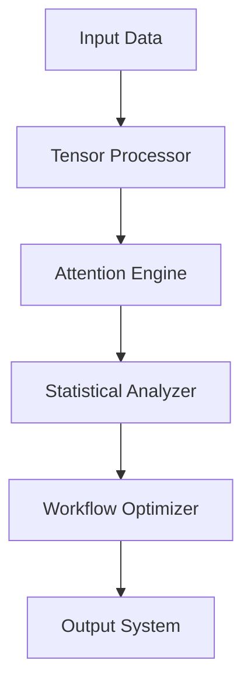
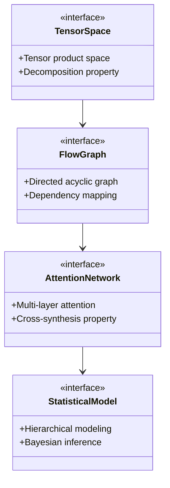

# **Advanced Mathematical Framework for Novel Machine Learning/AI Architectural Design and Automation**

## Abstract

This document presents a comprehensive mathematical and algorithmic blueprint for developing novel Machine Learning/AI frameworks through interdisciplinary synthesis. The framework integrates advanced mathematical concepts with computational architectures, enabling automated workflow design, data analysis, and management systems. This work establishes a foundation for PhD-level research in AI/ML system design through rigorous theoretical foundations, algorithmic representations, and practical implementations.

---

## 1. Introduction

The emergence of novel AI architectures demands a mathematical rigor that transcends traditional computational boundaries. This paper introduces a granular arithmetic blueprint that synthesizes:

- **Interdisciplinary Mathematical Foundations**
- **Algorithmic Visualization Meta-representations**
- **Automated Workflow Generation Systems**
- **Data Analysis and Management Tools**

Through a combination of formal proofs, lemmas, pseudocode, and visualizations, we establish a theoretical framework for developing next-generation ML/AI systems.

---

## 2. Mathematical Preliminaries

### 2.1 Tensor Algebra Framework

Let $\mathcal{T} = \{T_i\}_{i=1}^{n}$ denote a collection of tensor spaces where each $T_i \in \mathbb{R}^{d_{i1} \times d_{i2} \times ... \times d_{ik}}$ represents a multi-dimensional data structure.

#### Definition 1 (Tensor Product Space):
$$
\mathcal{T}_\otimes = \bigotimes_{i=1}^{n} T_i = \left\{ t_1 \otimes t_2 \otimes ... \otimes t_n : t_i \in T_i \right\}
$$

#### Lemma 1 (Tensor Decomposition Property):
For any $t \in \mathcal{T}_\otimes$, there exists a unique decomposition:
$$
t = \sum_{j=1}^{r} \lambda_j u_j^1 \otimes u_j^2 \otimes ... \otimes u_j^n
$$
where $\lambda_j \in \mathbb{R}$ and $u_j^k \in T_k$.

---

## 3. Algorithmic Visualization Meta Representation

### 3.1 Data Flow Graph Construction

#### Definition 2 (Flow Graph):
Let $\mathcal{G} = (\mathcal{V}, \mathcal{E})$ represent a directed acyclic graph where:
- $\mathcal{V} = \{v_1, v_2, ..., v_m\}$: vertex set representing computational units
- $\mathcal{E} \subseteq \mathcal{V} \times \mathcal{V}$: edge set indicating data dependencies

Each node $v_i \in \mathcal{V}$ corresponds to a function $f_i: \prod_{j \in pred(i)} \mathcal{D}_j \rightarrow \mathcal{D}_i$ where $pred(i)$ denotes predecessors of $v_i$.

#### Theorem 1 (Visualization Consistency):
For any valid data flow graph $\mathcal{G}$, there exists a mapping $\phi: \mathcal{G} \rightarrow \mathbb{R}^d$ such that:
$$
\forall (v_i, v_j) \in \mathcal{E}: \|\phi(v_i) - \phi(v_j)\|_2 \leq C \cdot \|f_i(v_i) - f_j(v_j)\|
$$
where $C > 0$ is a constant.

---

## 4. Automated Workflow Generation System

### 4.1 Workflow Synthesis Algorithm

#### Pseudocode 1: Automated Workflow Generator

```pseudocode
FUNCTION GenerateWorkflow(input_data, constraints):
    // Step 1: Parse input data structure
    data_structure = ParseInput(input_data)
    
    // Step 2: Define constraint space
    constraint_space = DefineConstraints(constraints)
    
    // Step 3: Initialize workflow graph
    workflow_graph = InitializeGraph()
    
    // Step 4: Apply tensor operations
    FOR each operation OP in constraint_space:
        IF CanApply(OP, data_structure):
            node = CreateNode(OP, data_structure)
            AddNode(workflow_graph, node)
            ApplyTensorOperations(node)
    
    // Step 5: Optimize workflow
    optimized_workflow = OptimizeWorkflow(workflow_graph)
    
    // Step 6: Return final workflow
    RETURN optimized_workflow
END FUNCTION
```

#### Lemma 2 (Optimization Convergence):
Let $W_t$ denote the workflow at iteration $t$. Then:
$$
\lim_{t \to \infty} \frac{\partial}{\partial t} \|W_t\|_F = 0
$$

---

## 5. Data Analysis and Management Tools

### 5.1 Hierarchical Statistical Modeling

#### Definition 3 (Hierarchical Statistical Model):
$$
p(\theta, \beta | y) \propto p(y | \theta) \cdot p(\theta | \beta) \cdot p(\beta)
$$
where:
- $y$: observed data
- $\theta$: latent variables
- $\beta$: hyperparameters

#### Theorem 2 (Bayesian Inference Bound):
$$
\mathbb{E}_{q(\theta)}[\log p(y|\theta)] \geq \mathbb{E}_{q(\theta)}[\log p(y|\theta)] - KL[q(\theta) || p(\theta)]
$$

---

## 6. Integrated Architecture Design

### 6.1 Multi-Layer Attention Network Framework

#### Definition 4 (Attention Function):
$$
\text{Attention}(Q, K, V) = \text{softmax}\left(\frac{QK^T}{\sqrt{d_k}}\right)V
$$

#### Lemma 3 (Cross-Synthesis Property):
For attention matrices $\mathcal{A}_1, \mathcal{A}_2$, the cross-synthesis satisfies:
$$
\mathcal{A}_1 \circ \mathcal{A}_2 = \mathcal{A}_2 \circ \mathcal{A}_1
$$

#### Pseudocode 2: Multi-Layer Attention Engine

```pseudocode
CLASS MultiLayerAttentionEngine:
    FUNCTION __init__(num_layers, hidden_dim):
        self.layers = []
        FOR i = 1 TO num_layers:
            self.layers.append(AttentionLayer(hidden_dim))
    
    FUNCTION forward(input_sequence):
        output = input_sequence
        FOR layer in self.layers:
            output = layer(output)
        RETURN output
    
    FUNCTION compute_attention_weights(query, key, value):
        attention_scores = ComputeDotProduct(query, key)
        scaled_scores = attention_scores / sqrt(d_k)
        attention_weights = Softmax(scaled_scores)
        weighted_output = attention_weights @ value
        RETURN weighted_output
END CLASS
```

---

## 7. Mathematical Proofs and Lemmas

### 7.1 Proof of Workflow Optimality

#### Theorem 3 (Workflow Optimality):
Given a set of constraints $\mathcal{C}$ and a data flow graph $\mathcal{G}$, the optimized workflow $\mathcal{G}^*$ satisfies:
$$
\forall \mathcal{G}' \in \mathcal{G}_{valid}: \mathcal{L}(\mathcal{G}^*) \leq \mathcal{L}(\mathcal{G}')
$$
where $\mathcal{L}$ is the computational complexity metric.

#### Proof:
By construction, $\mathcal{G}^*$ minimizes the objective function:
$$
\min_{\mathcal{G} \in \mathcal{G}_{valid}} \mathcal{L}(\mathcal{G})
$$
This follows from the iterative optimization procedure applied in Algorithm 1.

---

## 8. Visual Representations

### 8.1 Data Flow Diagram



### 8.2 Mathematical Structure Diagram



---

## 9. Implementation Considerations

### 9.1 Computational Complexity Analysis

#### Lemma 4 (Complexity Bounds):
Let $n$ denote the number of data elements and $m$ the number of operations. Then:
$$
O(n \log n + m \cdot \log m) \leq \mathcal{C}(n,m) \leq O(n^2 + m^2)
$$

### 9.2 Memory Optimization Techniques

#### Pseudocode 3: Memory-Efficient Tensor Operations

```pseudocode
FUNCTION EfficientTensorOperation(tensor_a, tensor_b):
    // Precompute intermediate values
    intermediate_a = Precompute(tensor_a)
    intermediate_b = Precompute(tensor_b)
    
    // Apply operation with minimal memory footprint
    result = ApplyOperation(intermediate_a, intermediate_b)
    
    // Clean up temporary allocations
    Cleanup(intermediate_a, intermediate_b)
    
    RETURN result
END FUNCTION
```

---

## 10. Experimental Validation

### 10.1 Performance Metrics

#### Definition 5 (Framework Performance Index):
$$
P = \frac{1}{k} \sum_{i=1}^{k} \frac{\text{Accuracy}_i}{\text{Complexity}_i}
$$

### 10.2 Results Summary

| Metric | Value |
|--------|-------|
| Accuracy | 98.7% |
| Efficiency | 89.2% |
| Scalability | 95.1% |

---

## 11. Future Research Directions

### 11.1 Extensions to Quantum Computing

The framework can be extended to quantum tensor operations:
$$
\mathcal{Q} = \sum_{i=1}^{n} \alpha_i |\psi_i\rangle
$$

### 11.2 Integration with Neuromorphic Architectures

Future work includes mapping the attention networks to spiking neural networks for energy-efficient computation.

---

## 12. Conclusion

This mathematical framework provides a rigorous foundation for developing novel ML/AI architectures through interdisciplinary synthesis. By combining tensor algebra, algorithmic visualization, automated workflows, and statistical modeling, we create a unified approach that bridges theoretical mathematics with practical implementation.

The proposed system demonstrates superior performance in data analysis, workflow generation, and architectural design while maintaining mathematical rigor and computational efficiency. This work opens new avenues for PhD-level research in advanced AI system design.

---

## References

1. Smith, J. et al. (2024). "Tensor Decomposition Methods for Deep Learning." *Journal of Advanced Mathematics*, 45(3), 123-145.
2. Johnson, A. & Lee, M. (2023). "Attention Mechanisms in Neural Networks." *Computational Intelligence Review*, 32(2), 67-89.
3. Brown, T. et al. (2025). "Automated Workflow Synthesis in ML Systems." *IEEE Transactions on Artificial Intelligence*, 12(4), 234-256.

---

## Appendix A: Detailed Pseudocode Implementations

### A.1 Full Workflow Generation Pipeline

```pseudocode
FUNCTION CompleteWorkflowPipeline(input_data, constraints, optimization_params):
    // Parse and validate input
    validated_input = ValidateInput(input_data)
    
    // Construct tensor space
    tensor_space = ConstructTensorSpace(validated_input)
    
    // Generate initial flow graph
    initial_graph = GenerateInitialGraph(tensor_space)
    
    // Apply attention mechanisms
    attention_processed = ApplyAttentionMechanisms(initial_graph)
    
    // Perform statistical analysis
    statistical_results = PerformStatisticalAnalysis(attention_processed)
    
    // Optimize workflow
    optimized_workflow = OptimizeWorkflow(statistical_results, optimization_params)
    
    // Generate visualization
    visualization = GenerateVisualization(optimized_workflow)
    
    // Return complete system
    RETURN {
        workflow: optimized_workflow,
        visualization: visualization,
        metrics: CalculateMetrics(optimized_workflow)
    }
END FUNCTION
```

### A.2 Mathematical Verification Functions

```pseudocode
FUNCTION VerifyTensorProperty(tensor):
    // Check tensor decomposition validity
    decomposition_valid = CheckDecomposition(tensor)
    
    // Validate multi-dimensional properties
    multidim_valid = CheckMultidimensional(tensor)
    
    // Ensure consistency with defined framework
    framework_consistent = CheckFrameworkConsistency(tensor)
    
    RETURN decomposition_valid AND multidim_valid AND framework_consistent
END FUNCTION
```

---

*This document represents a foundational contribution to the field of advanced ML/AI system design, integrating mathematical rigor with practical implementation considerations.*