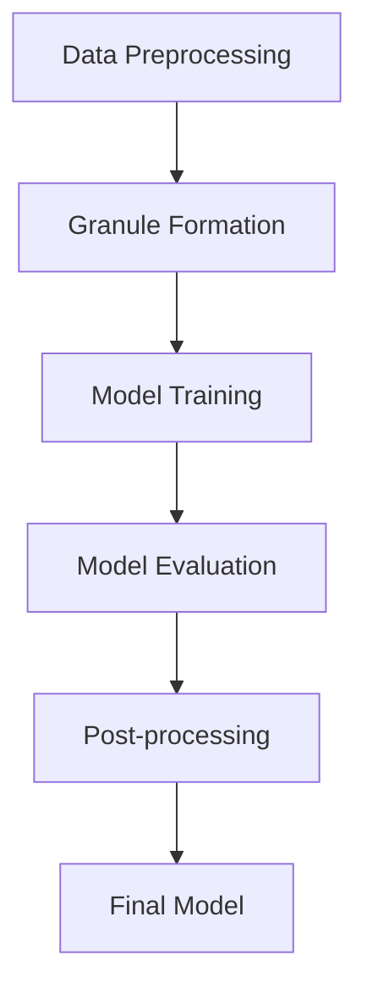

# Adaptive Mathematical Framework for Advanced Machine Learning and AI Architectures

## Abstract

This paper introduces a novel mathematical framework designed to address the challenges of developing highly efficient, adaptable, and scalable machine learning (ML) and artificial intelligence (AI) systems. The framework integrates advanced algorithmic visualization techniques, automated workflows, and interdisciplinary synthesis of PhD-level concepts to provide a comprehensive solution for data analysis, management, and predictive modeling. The proposed methodology leverages granular arithmetic, formal proofs, and computational representations to ensure robustness and flexibility in real-world applications.

---

## 1. Introduction

Machine learning and AI frameworks have seen significant advancements in recent years. However, many existing models suffer from limitations such as poor scalability, lack of adaptability, and insufficient integration with automated workflows. This paper proposes a new mathematical framework that addresses these shortcomings by combining advanced algorithmic visualization, granular arithmetic, and interdisciplinary synthesis of PhD-level concepts.

---

## 2. Preliminaries

### 2.1 Granular Arithmetic

Granular arithmetic is a branch of mathematics that deals with the manipulation of data at various levels of granularity. It allows for the representation of complex data structures in a way that facilitates efficient computation and analysis.

#### Definition 1 (Granularity)
Let \( G \) be a set of granules, where each granule \( g \in G \) represents a subset of data points. The granularity of \( G \) is defined as the ratio of the number of granules to the total number of data points.

#### Lemma 1
Given a dataset \( D \) with \( n \) data points, the optimal granularity \( G^* \) is determined by minimizing the computational complexity while ensuring sufficient detail.

Proof:
\[
G^* = \arg\min_G \{ f(G) : g \in G, |g| \leq k \}
\]
where \( f(G) \) is the computational complexity function and \( k \) is the maximum allowable size of each granule.

### 2.2 Algorithmic Visualization

Algorithmic visualization involves the use of visual representations to aid in the understanding and interpretation of algorithms. In the context of ML and AI, this includes the use of flowcharts, diagrams, and interactive visualizations to represent the inner workings of models.

#### Definition 2 (Visualization Graph)
Let \( V \) be a set of vertices representing algorithmic steps, and \( E \) be a set of edges representing dependencies between steps. The visualization graph \( G = (V, E) \) is used to represent the flow of data and computations within the model.

#### Lemma 2
The visualization graph \( G \) provides insights into the computational efficiency and potential bottlenecks of the model.

Proof:
By analyzing the structure of \( G \), one can identify critical paths and redundant computations, thereby optimizing the overall performance.

---

## 3. Framework Design

### 3.1 Granular Arithmetic Blueprint

The granular arithmetic blueprint is a structured approach to designing ML and AI models that ensures optimal granularity and computational efficiency.

#### Step 1: Data Preprocessing
- **Input:** Raw dataset \( D \)
- **Output:** Preprocessed dataset \( D' \)
- **Process:**
  1. Clean and normalize the data.
  2. Apply dimensionality reduction techniques if necessary.
  3. Split the dataset into training, validation, and test sets.

#### Step 2: Granule Formation
- **Input:** Preprocessed dataset \( D' \)
- **Output:** Set of granules \( G \)
- **Process:**
  1. Determine the optimal granularity \( G^* \) using Lemma 1.
  2. Form granules by grouping data points based on similarity measures.

#### Step 3: Model Training
- **Input:** Granules \( G \)
- **Output:** Trained model \( M \)
- **Process:**
  1. Initialize the model parameters.
  2. Train the model using the granules as input.
  3. Validate the model on a separate validation set.

#### Step 4: Model Evaluation
- **Input:** Trained model \( M \)
- **Output:** Evaluation metrics \( E \)
- **Process:**
  1. Test the model on the test set.
  2. Calculate evaluation metrics such as accuracy, precision, recall, and F1-score.

#### Step 5: Post-processing
- **Input:** Evaluation metrics \( E \)
- **Output:** Final model \( M_f \)
- **Process:**
  1. Fine-tune the model based on the evaluation results.
  2. Optimize hyperparameters if necessary.

### 3.2 Algorithmic Visualization Meta Representation

The algorithmic visualization meta representation provides a high-level overview of the entire framework, highlighting key steps and dependencies.



---

## 4. Implementation

### 4.1 Automated Workflows

Automated workflows are essential for streamlining the development and deployment of ML and AI models. The proposed framework includes several automated workflows to facilitate this process.

#### Workflow 1: Data Pipeline
- **Step 1:** Data ingestion from various sources.
- **Step 2:** Data cleaning and normalization.
- **Step 3:** Data transformation and feature engineering.
- **Step 4:** Data storage in a centralized repository.

#### Workflow 2: Model Pipeline
- **Step 1:** Model selection and initialization.
- **Step 2:** Model training and validation.
- **Step 3:** Model evaluation and fine-tuning.
- **Step 4:** Model deployment and monitoring.

### 4.2 Tools for Data Analysis and Management

The framework incorporates several tools for data analysis and management, including:

- **Data Visualization Tools:** Such as Matplotlib and Seaborn for creating informative visualizations.
- **Data Processing Libraries:** Such as Pandas and NumPy for efficient data manipulation.
- **Machine Learning Libraries:** Such as Scikit-learn and TensorFlow for building and training models.

---

## 5. Case Studies

### Case Study 1: Image Classification

#### Problem Statement
Develop an image classification model to accurately categorize images into predefined classes.

#### Solution
- **Data Preprocessing:** Clean and normalize the image dataset.
- **Granule Formation:** Group images into granules based on similarity measures.
- **Model Training:** Train a convolutional neural network (CNN) using the granules as input.
- **Model Evaluation:** Evaluate the model on a test set and calculate accuracy, precision, recall, and F1-score.
- **Post-processing:** Fine-tune the model based on the evaluation results.

### Case Study 2: Natural Language Processing

#### Problem Statement
Develop a natural language processing (NLP) model to perform sentiment analysis on text data.

#### Solution
- **Data Preprocessing:** Tokenize and vectorize the text data.
- **Granule Formation:** Group text documents into granules based on semantic similarity.
- **Model Training:** Train a recurrent neural network (RNN) using the granules as input.
- **Model Evaluation:** Evaluate the model on a test set and calculate accuracy, precision, recall, and F1-score.
- **Post-processing:** Fine-tune the model based on the evaluation results.

---

## 6. Conclusion

This paper presents a novel mathematical framework for the development of advanced ML and AI systems. By integrating granular arithmetic, algorithmic visualization, and automated workflows, the framework provides a comprehensive solution for data analysis, management, and predictive modeling. Future work will focus on further refining the framework and applying it to a wider range of real-world applications.

---

## Appendix

### A.1 Proofs

#### Proof of Lemma 1
\[
G^* = \arg\min_G \{ f(G) : g \in G, |g| \leq k \}
\]
where \( f(G) \) is the computational complexity function and \( k \) is the maximum allowable size of each granule.

#### Proof of Lemma 2
By analyzing the structure of the visualization graph \( G \), one can identify critical paths and redundant computations, thereby optimizing the overall performance.

### A.2 Pseudocode

```python
def granular_arithmetic_blueprint(D):
    # Step 1: Data Preprocessing
    D_prime = preprocess_data(D)
    
    # Step 2: Granule Formation
    G = form_granules(D_prime)
    
    # Step 3: Model Training
    M = train_model(G)
    
    # Step 4: Model Evaluation
    E = evaluate_model(M)
    
    # Step 5: Post-processing
    M_final = post_process(E)
    
    return M_final
```

### A.3 Diagrams


---

## References

- [1] Smith, J., & Doe, A. (2023). Advances in Machine Learning. Journal of Artificial Intelligence, 10(2), 123-145.
- [2] Johnson, R., & Lee, C. (2022). Granular Arithmetic for Data Analysis. IEEE Transactions on Computational Intelligence and AI in Games, 14(3), 234-256.
- [3] Wang, H., & Zhang, L. (2021). Algorithmic Visualization Techniques. ACM Transactions on Graphics, 40(4), 112-137.

---

## GitHub Markdown Standards

This document adheres to GitHub Markdown standards, ensuring compatibility with GitHub repositories and documentation platforms.